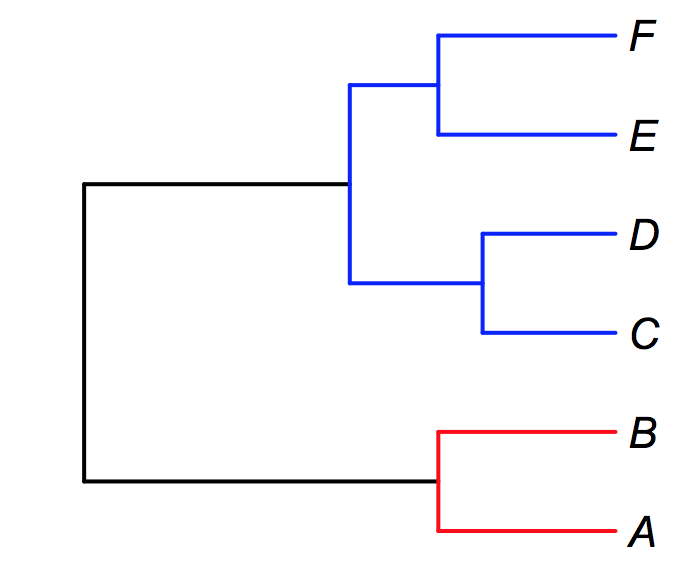

.. highlight:: none

Advanced analysis options
=========================
  
.. _incompsampling: 

Accounting for *non-random* incomplete taxon sampling in diversification studies
--------------------------------------------------------------------------------

**CAUTION**: For analyses of higher level phylogenetic trees where you have single representatives of different groups,
such as genus-level or family-level phylogenies, we **strongly recommend** that you use a stochastic polytomy resolver - such as PASTIS - to place the missing species
in the tree. The PASTIS method is described `here <http://onlinelibrary.wiley.com/doi/10.1111/2041-210X.12117/abstract>`_, and there 
is an associated R package. Using the analytical correction for incomplete taxon sampling
is less effective when your phylogenies are extremely incomplete (e.g., < 10% of tips sampled). Even with the uncertainty introduced by the PASTIS approach, 
you will obtain better results using this for highly incomplete phylogenies. 

**For less incomplete phylogenies**: It is well-known that incomplete taxon sampling can bias analyses of speciation and extinction from phylogenetic trees. If you have an incompletely-sampled tree (e.g., some fraction < 1 of the total extant species richness of your focal taxon), you can easily specify this sampling fraction to generate unbiased estimates of speciation and extinction under the assumption that *species are missing at random from the tree*. In your controlfile, you can specify the percentage of species that have been sampled by setting the ``globalSamplingFraction`` parameter. Specifically, you should have the following settings in your control file::

	useGlobalSamplingProbability = 1
	globalSamplingFraction = XYZ
	
where XYZ is the percentage of **total** taxa in your clade that are included in your phylogeny (e.g, if your clade has 100 species and your tree has 73, you should set ``XYZ = 0.73``). 
	
But what if your species are not sampled at random? BAMM allows you to incorporate several levels of such non-randomness into your analyses. Consider the following example. Suppose you wish to perform a diversification analysis on a clade consisting of two genera: *fu* and *bar*. In genus *fu*, you have sampled some species A and B, but another 8 species remain unsampled. In a second genus *bar*, you have sampled species C, D, E, and F, and are missing only a single species. You can conclude that you have a fraction 0.2 (2 / 10) of the species in *fu*, and 0.8 of the species in *bar* (4 / 5). Furthermore, since these are the only two genera in your focal tree, you know that the backbone of the phylogeny has a sampling probability of 1.0 (as there are no other genera in the clade that includes *fu* and *bar*). We can "paint" the relevant sampling fractions on this tree as follows, using red, blue, and black for the *fu*, *bar*, and backbone sampling fractions, respectively.

   
We can account directly for this type of incomplete sampling in BAMM. We need to do two things. First, we tell BAMM that we will not be using a single global sampling probability, but will rather specify clade- or species-specific sampling probabilities. In the control file, you set ``useGlobalSamplingProbability = 0``. You must then specify a filename that gives the relevant sampling fractions using the ``sampleProbsFilename`` argument. The format of this file is a bit peculiar. On the first line of the file, you give the backbone sampling probability (1.0 in the example here). 

Now, you add a separate line for *each sampled species* in your phylogeny (A, B, C, D, E, F in this example). Each line contains, with a tab separator, the following::

	speciesName	cladeName	samplingFraction

For species A, the relevant line would look like this::

	A	fu	0.2
	
And the full file, for all species, would look like this::
	
	1.0
	A	fu	0.2
	B	fu	0.2
	C	bar	0.8
	D	bar	0.8
	E	bar	0.8
	F	bar	0.8

For many datasets, this is an easy way of using incomplete sampling information. Suppose you are modeling diversification dynamics across all passerine birds. If you have all families of birds, but incomplete sampling within those families, it is straightforward to incorporate this sampling provided you are reasonably comfortable assuming monophyly of families. 

Specifying a backbone sampling fraction can pose some challenges if it is unlikely to equal 1.0. Here's an example where this is not equal to one. Continuing with the example above, suppose that there are several other general totaling 7 species in our focal clade that were not sampled. Provided we are (reasonably) confident that this genus does not reside *within* our genera *fu* and *bar*, this implies that these lineages must have branched off the backbone (black) portion of the phylogeny. One possible correction would be to assume that the 2 sampled backbone lineages are 2 of a total of 9 (including the 7 unsampled taxa from other genera), or 0.22. Another possibility is to just set the backbone fraction equal to the total sampling fraction across the entire clade. In this case, we have sampled a total of 6 species from *fu* and *bar*, which together account for 15 species. There are another 7 species unsampled from other genera. You could set the backbone fraction equal to 6 / (15 + 7) = 0.27. These are not perfect solutions, but we contend that - in general - it is better to use clade-specific sampling fractions if the percentage of sampled taxa varies considerably across your tree.

.. _ratepriors:

Priors on rate parameters
-------------------------------------------

In the :ref:`quickstart<quickstart>` guide to BAMM, we suggested that you explicitly set rate parameters to the scale of your data using the **BAMMtools** function ``setBAMMpriors``. 

To be clear, priors **really can matter** for a BAMM analysis. It is easy to specify really bad priors. In principle, we want the effects of somewhat arbitrary prior choice to be minimized for any dataset we might want to analyze. For the purposes of this discussion, we assume that you don't really care about the absolute magnitude of a given evolutionary rate: the important issue is how much these rates vary between clades and through time, and the relative differences between those rates is thus of paramount importance.

Here, in a nutshell, is the problem with the way priors are currently specified in BAMM. Because they are specified as absolute parameters of distributions, their effects are not independent of the "scale" of your tree. Suppose you run BAMM on some dataset with two clades, X and Y, leading to inferred clade-wise rates of :math:`\lambda_X` and :math:`\lambda_Y`. Suppose also that the estimated evolutionary rate at the root of your tree is :math:`\lambda_1` and that it declines to some rate :math:`\lambda_2` by the time it reaches the present. The prior distributions you choose should make the ratio of rates :math:`\lambda_X / \lambda_Y` and (:math:`\lambda_1` / :math:`\lambda_2`) invariant with respect to rescaling of the tree itself. Hence, if you multiply your branch lengths by 0.001 (or multiply them by 1000!) you want the ratios of those rates to be the same.

If you change the scale of your tree, you **will** have to change your prior distributions to avoid scale dependence. The function ``setBAMMpriors`` is designed to do this. It sets a relatively flat prior on ``lambdaInit``, ``betaInit``, and ``muInit``. It also sets a much more informative prior on those same parameters for the root process.

To set the main ``lambdaInit`` and ``muInit`` priors, ``setBAMMpriors`` first estimates the rate of speciation for your full tree under a pure birth model of diversification. We assume, arbitrarily, that a reasonable prior distribution for the initial rate parameters is an exponential distribution with a mean five times greater than this pure birth value. 

We also apply a separate prior distribution to the process at the root of the tree. The justification for this is that, in our experience, the root process is more sensitive to prior parameterization than any other processes. Hence, we set the mean of the prior distributions for rate parameters on the root process to exactly equal the pure birth rate. This is a conservative choice and probably reduces the probability of detecting weak rate heterogeneity through time. At the same time, it reduces the probability of detecting spurious declines in diversification attributable to misspecified priors.

For ``betaInitPrior`` and ``betaInitRootPrior``, the general settings are very similar. However, rather than fitting a pure-birth model, we find the maximum likelihood estimate of the variance parameter under a Brownian motion model. This is done analytically in **BAMMtools**.

For the shift parameters (``lambdaShiftPrior`` etc), the prior distribution is normal with a mean of zero. What standard deviation should we use? For ``setBAMMpriors``, we arbitrarily chose a prior distribution with a standard deviation *s* such that *2s* gives a parameter that results in either a 90% decline in the evolutionary rate or a 190% increase in rate on the interval of time from the root to the tips of the tree. If *T* is the root age of the tree (time before present), this value is computed as :math:`z = log(0.1)/ T`. The standard deviation parameter for the prior is just the value of *s* for which *2s* gives *z*.

**SUMMARY**: Using ``setBAMMpriors`` will give you a set of priors that are consistent across different scalings of your tree (assuming, of course, that you also use ``setBAMMpriors`` on the rescaled trees...).

Modeling *less complex* evolutionary scenarios
----------------------------------------------

The basic BAMM model is fairly complex, as it allows rate variation through time and among lineages. However, you can easily modify the control file for BAMM to perform several simpler types of analyses.

Constant rate birth-death model
*******************************

To perform Bayesian inference on your data under a constant-rate birth-death process, you can simply tell BAMM not to perform any MCMC update moves that are not part of the constant-rate birth-death process. Specifically, you should (i) not add rate regimes to the tree, and (ii) not update the parameter controlling speciation rate variation through time. You can do this by making sure the MCMC move frequencies are set as follows::

	updateRateEventNumber = 0
	updateRateEventPosition = 0
	updateRateEventRate = 0
	updateRateLambda0 = 1
	updateRateLambdaShift = 0
	updateRateMu0 = 1
 
Pure-birth model
************************
To run a pure-birth only model, with no extinction, you just turn off the extinction update::
	
	updateRateMu0 = 0
	
However, you must be careful to ensure that the initial value of extinction is set to zero. Since you are no longer updating this parameter through MCMC, whatever value it starts with is the value it will be stuck with::
	
	muInit0 = 0.0
	 
Note that you cannot account for incomplete sampling under a pure-birth model (modeling incomplete sampling is mathematically identical to allowing a particular type of extinction).

.. _constantratebamm:

MEDUSA-like model
************************

To run a Bayesian MEDUSA-like model, where the rate of speciation and extinction is constant within specific shift regimes, you can set your MCMC move frequencies as follows::
	
	updateRateEventNumber = 0.1
	updateRateEventPosition = 1
	updateRateEventRate = 1
	updateRateLambda0 = 1
	updateRateLambdaShift = 0
	updateRateMu0 = 1
	
And of course, we need to ensure that::

	lambdaShift0 = 0	
	
Here, we are simply setting the time-variation parameter (lambdaShift) of the BAMM model to zero, and also setting the update frequency for that parameter to zero. 

BAMM is sufficiently flexible as to allow a number of permutations on these general themes. In addition, the modifications to model setup described here also apply to trait evolution, where you could just as easily constrain a phenotypic analysis to involve only time-invariant Brownian motion processes (similar to the *Auteur* package for R), with the following code::
	
	updateRateBetaShift = 0.0
 	
 	betaShiftInit = 0.0
 
Accounting for phylogenetic uncertainty
---------------------------------------

Some researchers consider it important to account for phylogenetic uncertainty when performing macroevolutionary analyses. At present, there is no direct way of accounting for phylogenetic uncertainty in BAMM itself. It remains unclear whether phylogenetic uncertainty generally matters for the sorts of conclusions obtained with BAMM. My (DLR) personal view is that phylogenetic uncertainty is very much an issue for **some types** of results obtained using BAMM (and other programs), and (usually) not an issue at all for many other types of results. 

When does phylogenetic uncertainty **not** matter? For general inference on the overall tempo and mode of diversification, it is quite unlikely that - in general - your focal tree (say, MCC tree from BEAST, or ML tree from RAxML) is *so bad* that your broad-scale inferences in evolutionary dynamics are inaccurate. One reason for this is the somewhat paradoxical observation that confidence in *macroevolutionary conclusions* can be negatively correlated with confidence in *phylogenetic conclusions*. For example, consider a phylogeny showing a pattern of an early burst in lineage diversification, such that most major lineages arose during a brief period of time. You might never be able to resolve the *precise* order of branching of those lineages, and as such, you will always have a tree that is poorly resolved at the base. However, you might nonetheless be extremely confident that branch lengths are short near the base of the radiation (indeed, this is why you have low confidence in your topology!), and this means that your inferences on speciation rates themselves might be extremely robust. If you consider speciation in whales, as shown :ref:`here<whales_RatesThroughTime>` and :ref:`here<whales_RatesThroughTimeBW>`, phylogenetic uncertainty isn't going to change the big-picture conclusions: there was clearly a massive spike in evolutionary rates in some ancestral lineage leading to, or immediately nested within, the dolphin clade.

Phylogenetic uncertainty will matter if you do in fact care about *specific* aspects of changes in evolutionary dynamics. If you really care about the *precise* location of the shift in evolutionary dynamics, then the exact sequence of branching at the base of the dolphin radiation (to continue with the aforementioned example) **will** matter. Please keep in mind, however, that the BAMM model (and all other models), are merely statistical models that have imposed on the data. So, excessively fretting about whether the true shift in evolutionary dynamics occurred on branch *A* or branch *B* is somewhat unproductive, because the notion of a discrete shift is itself an assumption of the model we are using for inference.

Although BAMM does not directly allow modeling of phylogenetic uncertainty, it is straightforward to perform BAMM analyses across distributions of phylogenies taken from a Bayesian analysis. We will soon be adding documentation on how you can use your bash shell (on the OSX or Linux operating systems) to perform a BAMM analysis across a sample of trees.

.. _eventdatafile:

Understanding the event data file
---------------------------------

The event data file is the core of a BAMM analysis. Many advanced analyses can be done with this output. Each sample from the posterior under BAMM's model of rate shift variation consists of:

* Locations of evolutionary rate regimes for the focal sample

* Evolutionary rate parameters associated with each regime.

If you open the ``even_data.txt`` file with a text editor (or reading into R as a csv data table), you will see this header row (for a speciation-extinction analysis):

``generation,leftchild,rightchild,abstime,lambdainit,lambdashift,muinit,mushift``

For a trait analysis, it will look like:

``generation,leftchild,rightchild,abstime,betainit,betashift``

Each row of the event data file is a *macroevolutionary rate process*. Each sample from the posterior must have at least one process. Even if there is no evidence for a *rate shift* on the phylogeny, you must still have a set of rate parameters that begin at the root of the tree. The data recorded for each process (row) is as follows:

``generation``
	The generation of the MCMC simulation from which the process was sampled. If there is more than one process on the tree for a given generation, there will be multiple rows for that generation.
	
``leftchild`` and ``rightchild``
	Each process is associated with a particular branch or node on the tree, by definition. ``leftchild`` and ``rightchild`` are random descendants from the right and left branches from the node at the end (tipwards) of the branch on which the process begins. Knowledge of these descendants enables precise reconstruction of the topological location of a shift. For example, if you have the tree ((A,B),(C,D)), the root process (beginning at the root) could be specified by ``leftchild = A`` and ``rightchild = D``. These taxa *span* the clade defined by the node/branch in question. 
	
``abstime``
	Position in absolute time when a particular process begins, assuming time 0 at the root of the tree. Thus, the root process will always be characterized by a value of 0 here.
	
``lambdainit,lambdashift,muinit,mushift`` or ``betainit,betashift``
	Evolutionary rate parameters for the exponential change model 

