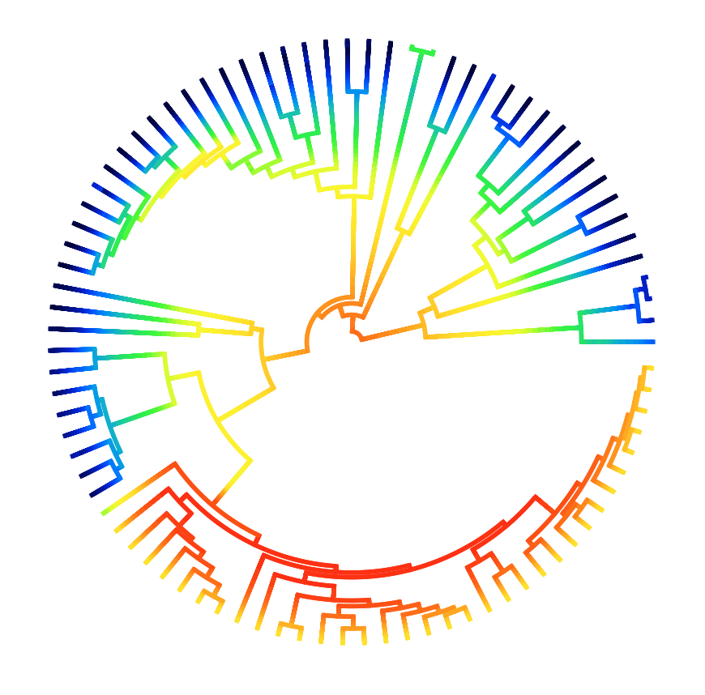
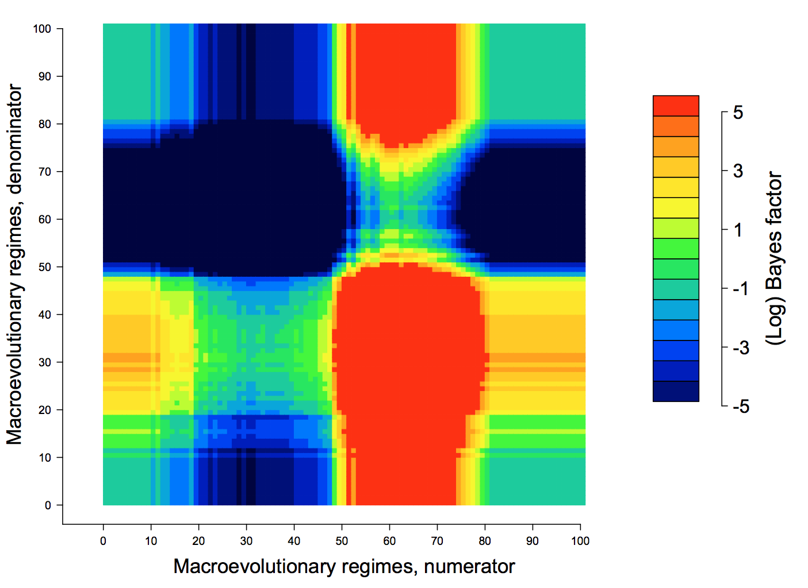
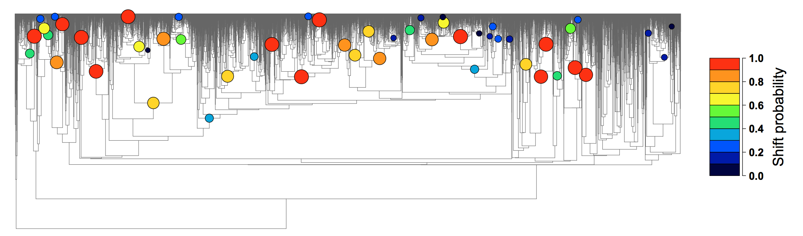
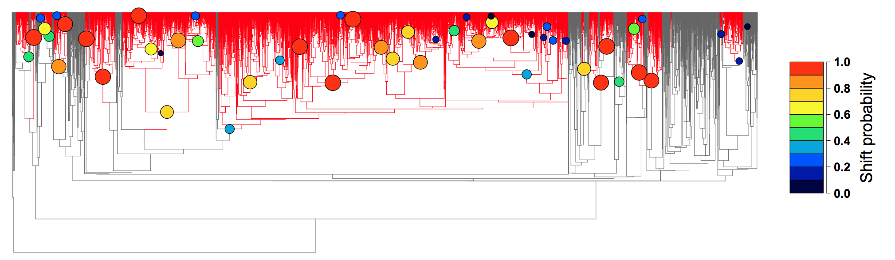

.. _bammgraphs:

BAMM graph gallery
==================

Tree-wide diversification heterogeneity
---------------------------------------

.. _dtpolar: 

   Figure X: Speciation rates (cool colors = slow, warm = fast) along each branch of the whale phylogeny from Steeman *et al.* (2009). Each unique color section of a branch represents the mean of the marginal posterior density of speciation rates on a localized segment of a phylogenetic tree. The "background rate" for lineages involves a temporal deceleration in speciation rates (note warm colors at root). One clade - the dolphins - is characterized by a massive increase in the rate of speciation. R code here (**link**).

Individual rate-shift configurations sampled by BAMM
----------------------------------------------------

.. _dtmulti: 
.. figure:: figs/xMultipleShifts.png
   :width: 500
   :align: center

Three evolutionary rate configurations (speciation) sampled by BAMM for the cetacean phylogeny, under three different color schemes (warm colors = fast rates). Columns show the 10\ :sup:`th`, 20\ :sup:`th`, and 30\ :sup:`th` samples from the posterior distribution included as an example in BAMMtools (see the **events.cetaceans** dataset). Black circles denote the position of the macroevolutionary regime shifts present in each sample. Every sample from the posterior contains a potentially unique configuration of shift locations, which are sampled in proportion to their posterior probability. The trees shown in this figure differ from the preceding figure, which shows the mean marginal rates over all samples in the posterior. Note the consistent spike and subsequent deceleration in rates that occurs after shift events. R code for this figure available :download:`here<figs/plot_multishift.R>`.

Phenotypic evolutionary rates
-----------------------------

Some tree showing phenotypic evolutionary rates::

	**Needs to be done.** 

Evolutionary rate variation through time 
----------------------------------------

.. _rttwhale: 
.. figure:: figs/xGrayscaleWhalerates.png
   :width: 700
   :align: center

   Figure X: Grayscale plot of speciation rates through time during the radiation of modern whales. Polygons denote 10% through 90% Bayesian credible regions on the distribution of rates at any point in time, given at 10% increments. The middle figure shows the rate-through-time estimates for the dolphins alone, and the right-hand figure shows the background rates for all whales once the dolphin clade has been excluded. R code here (**link**).

Rate variation through time: color density plot
-----------------------------------------------

Evolutionary rates through time, color version with density shading::

	**Needs to be done.** 

Bayes factors
----------------

.. _pwbffig: 

   Figure X: Pairwise matrix of Bayes factors for the JEA bird phylogeny (Jetz *et al*, **Nature**, 491:444-448, 2012). Orange/red colors involve decisive comparisons between models (Bayes factor evidence > 100). Color bar on right gives interpretation of colors in units of log(Bayes factor). Models with fewer than 50 processes fare poorly when compared to models with approximately 55 - 65 processes. This suggests the presence of massive diversification rate heterogeneity across the avian phylogeny. R code :download:`here<figs/BF_pairwise.R>`.
 
Maximum shift credibility tree
-------------------------------

.. _maxcredibility: 

   
   Figure X: The *maximum shift credibility configuration* (or *MSC* tree) for the JEA bird phylogeny (6670 tips). The MSC tree displays the joint distribution of rate shift configurations that maximize the marginal probability of the data. This is analogous to the *maximum clade credibility tree* in Bayesian phylogenetic analyses. Tree shows the location of shifts, as well as their marginal probabilities (color and size). It is important to recognize that rate shifts with low marginal probability (e.g., blue nodes) can still be consistent with extremely high *cumulative* shift probabilities (see `Cumulative Shift Probability`_). R code here (**link**).
      
      
Cumulative shift probability
-----------------------------
.. _cst: 

   
   Figure X: The *cumulative shift probability configuration* shows the cumulative marginal probability that a given node/branch is characterized by evolutionary rate dynamics that are decoupled from the "background" rate. In this figure, all branches with cumulative shift probabilities greater than 0.95 are shown in red. The maximum shift credibility configuration is also shown, for comparison. Note that some nodes have relatively low marginal shift probabilities, but the subtrees descended from them have extremely high cumulative shift probabilities. R code here (**link**).

