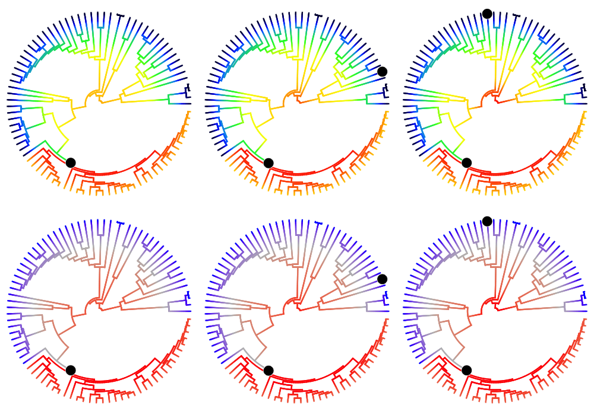
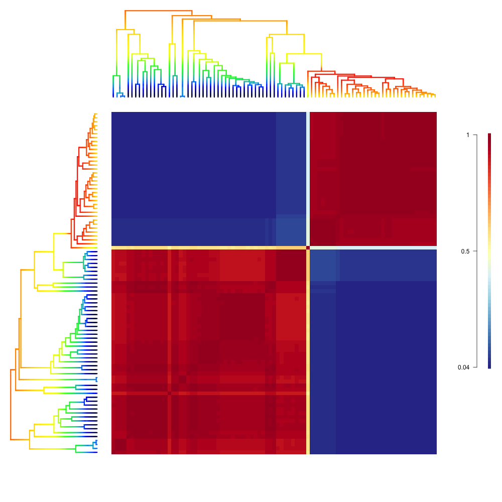
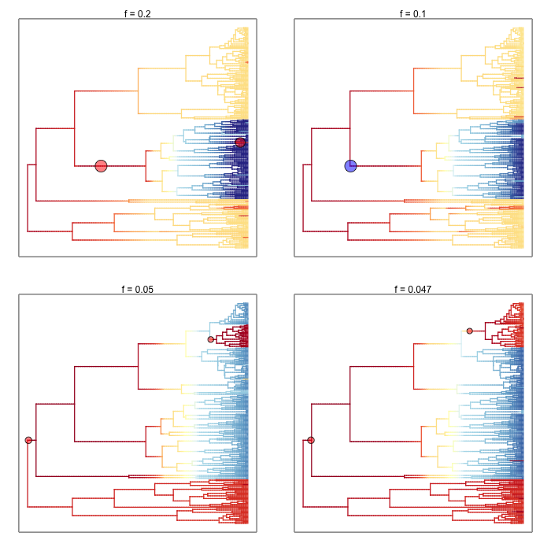

.. _bammgraphs:

BAMM graph gallery
==================

A collection of graphics from BAMM and BAMMtools. R code to produce images is given below each panel. Much more detail on BAMMtools analysis is given :ref:`here<bammtools>`.

Phylorate plot
---------------------------------------

.. _bammgraphgallery1: 
.. figure:: v2rcode/bammgraphgallery1.png
   :width: 400
   :align: center

A **phylorate plot** showing speciation rates (cool colors = slow, warm = fast) along each branch of the whale phylogeny from Steeman *et al.* (2009). Each unique color section of a branch represents the mean of the marginal posterior density of speciation rates on a localized segment of a phylogenetic tree. The "background rate" for lineages involves a temporal deceleration in speciation rates (note warm colors at root). One clade - the dolphins - is characterized by a massive increase in the rate of speciation.:

	library(BAMMtools)
	data(whales, events.whales, prior.whales)
	edata_whales <- getEventData(whales, events.whales, burnin=0.1)
	plot.bammdata(edata_whales, lwd=2, method="polar", pal="temperature")

	 
 
 

Individual rate-shift configurations sampled by BAMM
----------------------------------------------------

.. _bammgraphgallery2: 

Phylorate plots for three evolutionary rate configurations (speciation) sampled by BAMM for the cetacean phylogeny, under two different color schemes (warm colors = fast rates). Columns show the 10\ :sup:`th`, 20\ :sup:`th`, and 30\ :sup:`th` samples from the posterior distribution included as an example in BAMMtools (see the **events.whales** dataset). Black circles denote the position of the macroevolutionary regime shifts present in each sample. Every sample from the posterior contains a potentially unique configuration of shift locations, which are sampled in proportion to their posterior probability. The trees shown in this figure differ from the preceding figure, which shows the mean marginal rates over all samples in the posterior. Note the consistent spike and subsequent deceleration in rates that occurs after shift events::

	ixx <- rep(c(10, 30, 40), 2);
	plot.new()  
	par(mfrow=c(2,3));
	colschemes <- list();
	colschemes[1:3] <- 'temperature'
	colschemes[4:6] <- list(c('blue', 'gray', 'red'))

	for (i in 1:length(ixx)) {
		par(mar=c(0,0,0,0))
		index <- ixx[i]
		eventsub <- subsetEventData(edata_whales, index=index);
		plot.bammdata(eventsub, method='polar', pal= colschemes[[i]], par.reset=FALSE, lwd=3)
		addBAMMshifts(eventsub, method='polar', index=1, col='white', bg='black', cex=5, par.reset=FALSE)
	}

Distinct shift configurations and their frequencies
----------------------------------------------------

.. _bammgraphgallery3: 
.. figure:: v2rcode/bammgraphgallery3.png
   :width: 500
   :align: center

BAMM enables the user to tabulate the "distinct shift configurations" within a given dataset as well as the posterior probability of each configuration. Each distinct shift configuration may have been sampled multiple times during simulation of the posterior. This is directly analogous to a credible set of topologies from a Bayesian phylogenetic analysis. This example shows 95% credible set of shift configurations from the analysis of the whale phylogeny::

	data(prior.whales)
	pset <- getBranchShiftPriors(whales, prior.whales)
	cset <- credibleShiftSet(edata_whales, pset, BFcriterion=3)
	plot.credibleshiftset(cset, lwd=2.5)
 
Macroevolutionary cohort matrix
----------------------------------------------------

.. _bammgraphgallery4: 

Macroevolutionary cohort analysis displays the pairwise probability that any two species share a common macroevolutionary rate dynamic. These pairwise probabilities can be extracted quickly from BAMM output using the function ``getCohortMatrix``. The example above shows the cohort matrix for the whales dataset included with BAMMtools. Each cell of the cohort matrix corresponds to pair of tip taxa from the whale phylogeny; the phylogeny is plotted for reference in the left and upper margins of the figure. You can read this plot by drawing an imaginary line between any two tips of the tree; the color of the matrix at their intersection is the probability that those taxa share a common rate dynamic. Species pairs that share a common rate dynamic have red cohort matrix colors; species with decoupled macroevolutionary dynamics have blue cohort matrix colors (the legend on the right gives the actual cohort probability). The cohort matrix method is fully explained in this (`Systematic Biology article <http://sysbio.oxfordjournals.org/content/early/2014/04/01/sysbio.syu025>`_). The biological interpretation of the above results is that there are two general macroevolutionary dynamics across whales: one pertaining to the dolphins, and one pertaining to the non-dolphins. The single isolated lineage in the middle of the plot that shows intermediate correlations with the "fast clade" (dolphins) and "slow lineages" (non-dolphins) is the killer whale. BAMMtools provides functions that allow easy generation of cohort matrices::

	cmat <- getCohortMatrix(edata_whales)
	cohorts(cmat, edata_whales, lwd=3, pal="temperature")

Phenotypic evolutionary rates
-----------------------------

.. _bammgraphgallery5: 

BAMM and BAMMtools can also be used to analyze rates of phenotypic evolution. Here are the four most probable macroevolutionary rate shift configurations (and their overall frequencies) for the evolution of body size across a phylogenetic tree of living primates. As in the above phylorate plots, branch colors reflect the instantaneous rate of body size evolution. This dataset is included as an example with BAMMtools::

	data(primates, events.primates, prior.primates)
	ed_prim <- getEventData(primates, events.primates, burnin=0.1, type = "trait")
	pprior <- getBranchShiftPriors(primates, prior.primates)
	css_prim <- credibleShiftSet(ed_prim, pprior)
	plot.credibleshiftset(css_prim, lwd=1.7, plotmax=4)
 

Rate variation through time: color density plot
-----------------------------------------------

.. _bammgraphgallery6: 
.. figure:: v2rcode/bammgraphgallery6.png
   :width: 700
   :align: center
   
Evolutionary rates through time for whales, with color density shading to denote confidence on evolutionary rate reconstructions at any point in time::

	plot.new()
	par(mfrow=c(1,3))
	st <- max(branching.times(whales))
	plotRateThroughTime(edata_whales, intervalCol="red", avgCol="red", start.time=st, ylim=c(0,1), cex.axis=2)
	text(x=30, y= 0.8, label="All whales", font=4, cex=2.0, pos=4)
	plotRateThroughTime(edata_whales, intervalCol="blue", avgCol="blue", start.time=st, node=141, ylim=c(0,1),cex.axis=1.5)
	text(x=30, y= 0.8, label="Dolphins only", font=4, cex=2.0, pos=4)
	plotRateThroughTime(edata_whales, intervalCol="darkgreen", avgCol="darkgreen", start.time=st, node=141, nodetype = "exclude", ylim=c(0,1), cex.axis=1.5)
	text(x=30, y= 0.8, label="Non-dolphins", font=4, cex=2.0, pos=4)

Evolutionary rate variation through time: grayscale
----------------------------------------------------

.. _bammgraphgallery7: 
.. figure:: v2rcode/bammgraphgallery7.png
   :width: 700
   :align: center

Grayscale plot of speciation rates through time during the radiation of modern whales. Shaded polygon denotes the 10% through 90%  Bayesian credible regions on the distribution of rates at any point in time. The middle figure shows the rate-through-time estimates for the dolphins alone, and the right-hand figure shows the background rates for all whales once the dolphin clade has been excluded::

	plot.new()
	par(mfrow=c(1,3))
	st <- max(branching.times(whales))
	plotRateThroughTime(edata_whales, avgCol="black", start.time=st, ylim=c(0,1), cex.axis=2, intervalCol='gray80', intervals=c(0.05, 0.95), opacity=1)
	text(x=30, y= 0.8, label="All whales", font=4, cex=2.0, pos=4)
	plotRateThroughTime(edata_whales, avgCol="black", start.time=st, node=141, ylim=c(0,1),cex.axis=1.5,intervalCol='gray80', intervals=c(0.05, 0.95), opacity=1)
	text(x=30, y= 0.8, label="Dolphins only", font=4, cex=2.0, pos=4)

	plotRateThroughTime(edata_whales, avgCol="black", start.time=st, node=141, nodetype = "exclude", ylim=c(0,1), cex.axis=1.5,intervalCol='gray80', intervals=c(0.05, 0.95), opacity=1)
	text(x=30, y= 0.8, label="Non-dolphins", font=4, cex=2.0, pos=4)

