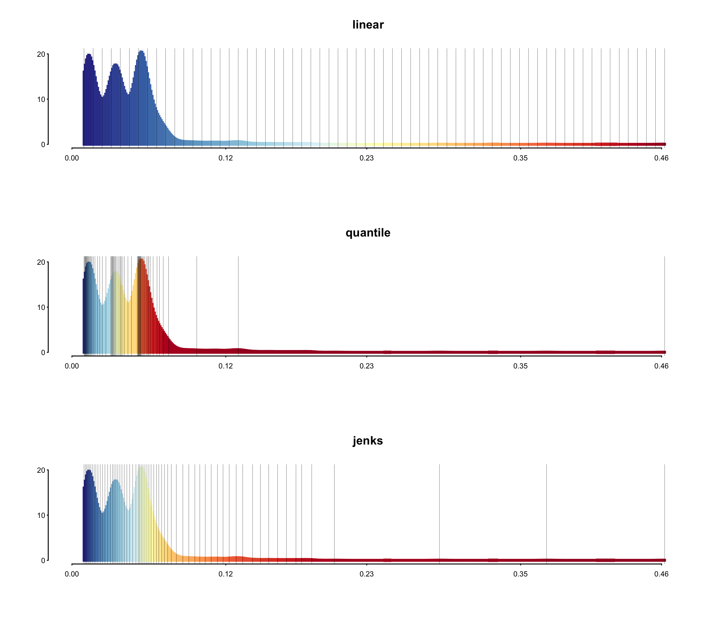
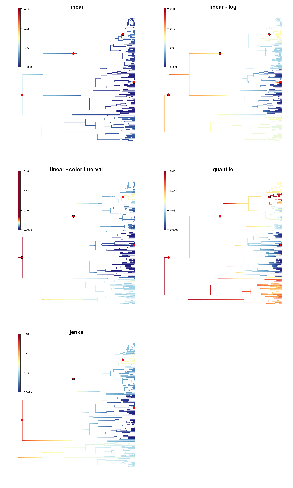

.. _colorbreaks:

Color ramps and phylorate plots
===============================

When plotting instantaneous rates along the branches of a phylogeny with ``plot.bammdata`` (as well as with any other BAMMtools function that creates a phylorate plot), it is important to keep in mind how rates are mapped to colors, and what this can mean for interpretation. 

What options are available?
...........................

``plot.bammdata`` has a number of options available to bin rates into particular colors (the breaksmethod options). Depending on the dataset, these different options can lead to drastically different phylorate plots. On top of these breaksmethods, there are additional data transformation/truncation options that will modify the behavior of the breaksmethods. 

The breaksmethod options are:

1. **linear method**:

	Rates across the phylogeny are divided into equal-width bins, and a color from the defined color ramp is associated with each of these bins. The range of this linear color mapping is defined by the fastest and the slowest rates across the tree, regardless of the frequency of these rates. This method can lead to misleading interpretations if the fastest or slowest rates are only represented by a small fraction of the tree, giving the appearance of a lack of rate heterogeneity. 

2. **quantile method**:

	Rates are divided into bins, such that each bin has the same density of rates. This method can potentially be misleading in that it might over-emphasize minor rate variation. 

3. **Jenks natural breaks method**:

	Rates are divided into bins such that the variance within bins is minimized, while the variance between bins is maximized. 

Additional options include:

A. **log transformation**:

	For any of these breaksmethods, the rates can first be log-transformed, by setting ``logcolor = TRUE``. 

B. **color.interval**:

	The minimum and maximum values of rate values can be manually provided. This has the effect of setting anything greater than the new maximum to the maximum color value, and anything less than the new minimum to the minimum color value. Values across this color interval are then mapped according to the specified breaksmethod. 

It is important to understand that while these different color mapping methods can lead to different phylorate plots, **the underlying raw data remains the same** (or log-transformed) and any downstream quantitative analyses of rates are completely unaffected by the breaks method chosen. 

We illustrate these differences with an example. This is a BAMM analysis of primate body mass (Vos and Moors 2008). For each breaks method, we generated a histogram showing the frequency of rate values in the dataset, colored according to the selected breaks method. Vertical bars show how the rates have been binned. 

From these histograms, it is clear that there are segments of the phylogeny with much higher rates than for the rest of the phylogeny, but these segments encompass only a very small subset (the histogram has a long tail). 

.. _breaksTest:

Now we show how these different methods produce different phylorate figures. Due to the long tail of the distribution of rates, the linear breaks method does a poor job of showing rate variation across the phylogeny. 

.. _breaksTestTrees:

What should you do?
...................

Although, we have provided a number of options to best convey rate variation across a phylogeny, it is now possible to generate a large number of different phylorate plots and it is important to not misuse these options. Despite what may be written in an accompanying text, people will interpret these phylorate plots as evidence of significant rate dynamics. Therefore it will be important to carefully select from these options.

The goal is to find the right balance between a visually appealing figure and one that properly portrays the information at hand. We do not want to hide real rate variation, but we also do not want to exaggerate rate heterogeneity "noise" coming from non-core shifts. 

One recommendation would be to use the locations of core shifts as a guide for what **should** be emphasized with the colors. In the above figure, the linear method fails to highlight existing rate shifts, although log-transformation of the rates, or use of ``color.interval`` alleviates the problem. The quantile method is exaggerating the existing rate variation in this case. The jenks method appears to do a good job in most cases. We suggest that ``color.interval`` only be employed when necessary, in combination with the ``linear`` breaksmethod, as the misuse of this option can lead to misrepresentation of rates on a phylogeny. 

How do I plot these histograms?
...............................

For those interested in exploring rate heterogeneity in the form of a histogram, we demonstrate how the above histograms were created::

	library(BAMMtools)
	#load data
	data(primates, events.primates)
	ed <- getEventData(primates, events.primates, burnin=0.25, type = 'trait')

	#create phylorate plot to generate output
	q <- plot.bammdata(ed, breaksmethod='jenks')

	plot.new();
	x = q$colordens[,1]
	y = q$colordens[,2]
	plot.window(xlim = c(min(0,min(x)), max(x)), ylim = c(0, max(y)))
	segments(x, y, x, 0, lend = 2, col = q$colordens[,3], lwd=3)
	axis(1, signif(seq(min(0,min(x)), max(x), length.out = 5), 2), xaxs = "i", cex.axis = 0.75, tcl = NA, mgp = c(0, 0.25, 0))
	axis(2, round(seq(0, max(y), length.out = 3), 0), las = 1, yaxs = "i", cex.axis = 0.75, tcl = NA, mgp = c(0, 0.25, 0))
	    
	#add breaks as vertical lines
	abline(v=q$colorbreaks, lwd=0.2, lty=1)
	title(main='jenks', cex.main=2)

