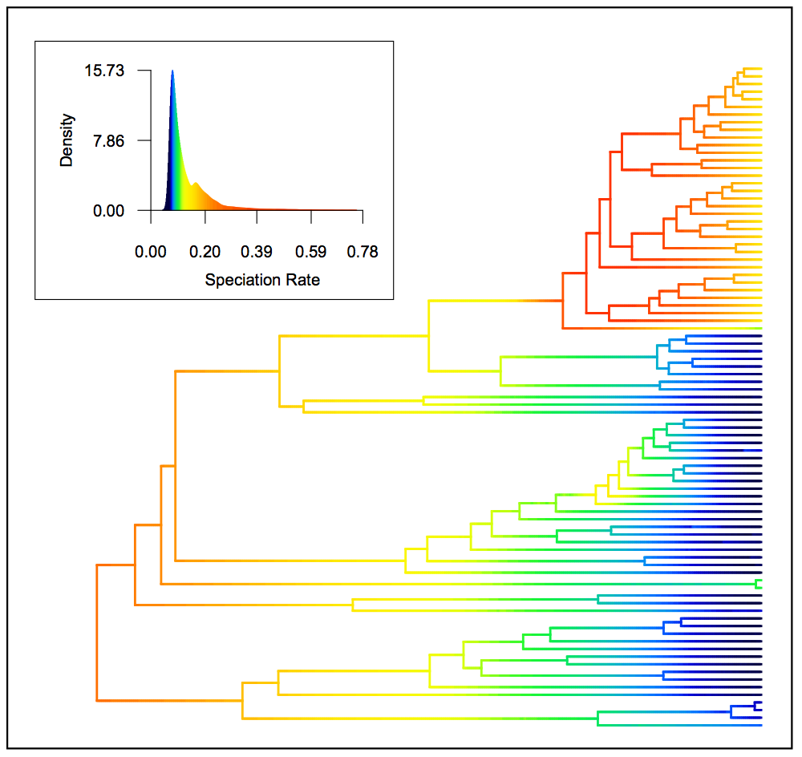

.. _bammfunction: 
  
Introduction
============

Bayesian Analysis of Macroevolutionary Mixtures
-----------------------------------------------
  
BAMM (Bayesian analysis of macroevolutionary mixtures) is a program for
modeling complex dynamics of speciation, extinction, and trait evolution on
phylogenetic trees. The program is oriented entirely towards detecting and
quantifying heterogeneity in evolutionary rates. BAMM uses reversible jump
Markov chain Monte Carlo to automatically explore a vast universe of candidate
models of lineage diversification and trait evolution. BAMM and associated methods have been described
and extended in several publications (`PLoS ONE 2014 <http://www.plosone.org/article/info%3Adoi%2F10.1371%2Fjournal.pone.0089543>`_ ,  `Nature Communications 2013 <http://www.nature.com/ncomms/2013/130606/ncomms2958/full/ncomms2958.html>`_ , `Systematic Biology 2014 <http://sysbio.oxfordjournals.org/content/63/4/610>`_, and `Evolution 2015 <http://onlinelibrary.wiley.com/doi/10.1111/evo.12681/abstract>`_). BAMM is a command line program written in C++. Post-run analysis and visualization is performed using
the R package `BAMMtools <http://onlinelibrary.wiley.com/doi/10.1111/2041-210X.12199/abstract>`_.

 
Why Use BAMM?
---------------

**Allows modeling of rates through time and among clades.**
BAMM abandons the simple notion of *rate shifts* involving constant-rate
diversification processes. A rate shift in the BAMM environment is a shift in
the evolutionary dynamics of a system and can involve shifts to new
time-varying or diversity-dependent evolutionary rate regimes.

**Detects evolutionary rate heterogeneity.**
BAMM allows explicit tests of the hypothesis that a single process of
diversification can account for a given phylogenetic pattern. The program
automatically explores many candidate models of diversification and provides a
variety of tools for interpretation. BAMM enables estimation of Bayesian
credible intervals on the number of distinct macroevolutionary regimes,
calculation of Bayes factors for pairwise evaluation of model fit, and
calculation of model posterior probabilities. The user can easily determine the
evidence favoring rate variation within phylogenies.

**Detects key innovations and diversity-dependence.**
BAMM is oriented towards the automatic detection of key innovations, rate
shifts, and diversity-dependence on phylogenetic trees. BAMM finds locations
for shifts in evolutionary dynamics that are maximally supported by the data,
with no *a priori* specification as to where these shifts in dynamics might
have occurred.

**Analysis and visualization with BAMMtools.**
BAMMtools is a comprehensive R library for the analysis and visualization of
macroevolutionary dynamics. The package includes a variety of functions for
analyzing and visualizing BAMM output. Examples of BAMMtools functionality
includes: visualization of distinct evolutionary regimes on phylogenetic trees,
calculation of Bayes factors, plotting evolutionary rates through time,
estimating clade-specific average rates, and visualizing rate variation along
the branches of individual phylogenetic trees (as shown :ref:`in this figure<whaleratesintro>`).

**It is better than stepwise AIC.**
Many methods for modeling evolutionary dynamics use stepwise AIC-based
approaches that are limited to identifying a single best model. These
approaches are inherently limited, because many distinct combinations of
evolutionary shift regimes might have roughly equal probabilities. Rather than
identifying a single best configuration of rate shifts, BAMM samples rate shift
configurations in proportion to their posterior probability. Please :ref:`read our detailed explanation <rateshifts>` of problems associated with stepwise AIC and other methods that identify a single "best" rate shift configuration.

**It is fast.**
BAMM's underlying C++ core allows rapid modeling of evolutionary dynamics in
phylogenetic datasets that would be too large to handle with R alone.

.. _whaleratesintro: 

   Speciation rates in whales, reconstructed using BAMM. BAMM can estimate the
   posterior density of evolutionary rates (speciation, extinction, trait
   evolution) at any point in time along any branch in a phylogenetic tree.
   Major burst in rates at top of tree corresponds to the origin of the dolphin
   clade. See the :ref:`bammgraphs` for more examples involving BAMM. Inset
   histogram shows posterior density of speciation rates and allows color-based
   interpretation of rates on the whale phylogeny.  Figure was generated using
   the ``plot.bammdata(...)`` function from the **BAMMtools** package in R. Dataset in
   this example is taken from M. Steeman *et al.*, *Syst. Biol.* 58:573-585,
   2009). 
   

