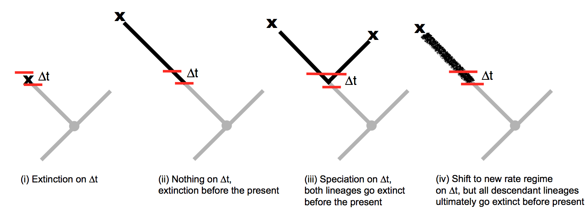
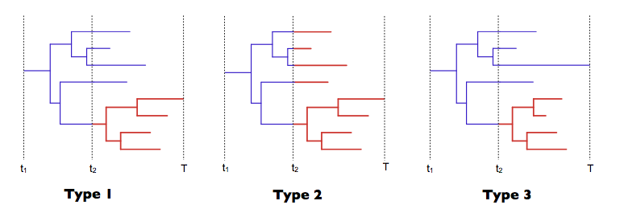
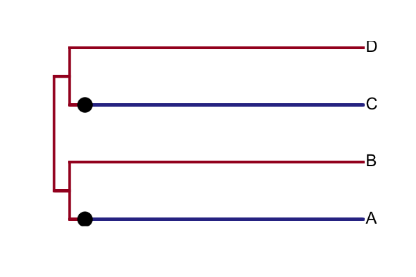

.. _likelihood:

The BAMM likelihood function
==========================================================

Introduction: models for rate shifts
............................................
This page discusses a number of important theoretical issues involving BAMM. The objective is both to clarify BAMM's assumptions, and also to point out some outstanding theoretical problems/challenges for future work. These issues are more general than BAMM and (probably) apply to all other software implementations and modeling frameworks that purport to compute the likelihood of a phylogenetic tree with a mapped (= assumed) configuration of **rate shifts** under the condition of **non-zero extinction rates**. Other implementations/approaches that must confront the issues raised below include the `MEDUSA model <http://www.pnas.org/content/106/32/13410.abstract>`_, the 'split' option for `BiSSE  <http://onlinelibrary.wiley.com/doi/10.1111/j.2041-210X.2012.00234.x/abstract>`_, `QuaSSE <http://sysbio.oxfordjournals.org/content/59/6/619.abstract>`_, `GeoSSE <http://sysbio.oxfordjournals.org/content/60/4/451>`_, and related models, the DDD models with different shift regimes on `specific subclades  <http://www.jstor.org/stable/10.1086/667574>`_, and multi-process shift models as currently implemented in `RPANDA <http://www.pnas.org/content/108/39/16327.abstract>`_. 

Is the BAMM likelihood correct?
.................................    

A recent `post <https://github.com/macroevolution/bamm/issues/137>`_ to our Github repository called attention to one seemingly peculiar feature of the likelihood function in BAMM. The likelihood function is, of course, the core of inference using BAMM. If the likelihood function is incorrect, or if it is based on flawed assumptions, inferences based on the method may be problematic. Note that here we are concerned with whether the theoretical model in BAMM itself is correct, not whether the model itself is implemented correctly. In :ref:`this<testlikelihood>` section, we describe how users can validate the actual BAMM likelihood itself (e.g., is the program computing what we think it is computing?). But for now, some theory. 

The BAMM likelihood is based on a set of differential equations that describe transition probabilities for a stochastic birth-death process. These equations are solved from tips-to-root of a phylogeny along individual branches, and probabilities are combined at nodes; when we've reached the root, we will have computed the likelihood for the full tree. The `original BiSSE paper <http://sysbio.oxfordjournals.org/content/56/5/701.abstract>`_ remains my (DLR) all-time favorite explanation (both graphically and mathematically) for how the likelihood of a phylogeny can be computed under a birth-death process; I strongly recommend it as a prelude to the discussion below.

The likelihood calculations in BAMM are simpler than those in BiSSE, because BAMM is not concerned with character states -- or at least, in BAMM, we know which state (shift regime) we are in. BiSSE is somewhat more complex, because the method integrates over all possible (unobserved) transitions in character states. 

The differential equations for the BAMM likelihood involve two probabilities. The first, :math:`D(t)`, is the probability that a lineage at some point in time (i.e., a location on an observed branch of a phylogeny) gives rise to all observed downstream data -- specifically, all the lineages descended from this particular point on the tree. The second equation, :math:`E(t)`, describes the probability that a lineage at the same point in time (along with all of its descendants) has gone extinct before the present. Letting :math:`\lambda` denote the speciation rate and :math:`\mu` the extinction rate, we have: 

.. math::

	\frac{dD}{dt} = -(\lambda + \mu)D(t) - 2 \lambda D(t) E(t)  
		
.. math::	
	\frac{dE}{dt} = \mu -(\lambda + \mu)E(t) + \lambda E(t)^2
 
	
These equations are derived from considering the state space for all possible events that could have happened on some infinitesimal time interval :math:`\Delta t`. For the extinction probability :math:`E(t)`, BAMM assumes that any given interval of time :math:`\Delta t` can be described by one of the following events:

.. _extinctionprob1: 
.. figure:: figs/BAMM_E_t_3event.png
   :width: 550
   :align: center
   
That is, a lineage alive at some time in the past can go extinct before the present (along with all of its descendants) if one of the following occurs on :math:`\Delta t` : 
 
* Extinction on :math:`\Delta t`: This event occurs with probability proportional to :math:`\mu`. 
	
* No extinction, no speciation : Nothing happens on the focal interval, but the lineage and all of its descendants goes extinct before the present. This event occurs with probability :math:`-(\lambda + \mu)E(t)`.
	
* Speciation : A speciation event occurs on :math:`\Delta t`, but both descendant lineages (and any additional descendants) go extinct before the present. This event occurs with probability proportional to :math:`\lambda E(t)^2`. 
 
These three terms are combined into the differential equation for the change in the extinction probability with respect to time, :math:`dE / dt`. 

There is one curious feature of scenarios described above as used in BAMM, and it is that they neglect another type of event that *could have occurred* on :math:`\Delta t`. Specifically, it is possible that a lineage could have undergone a shift to an entirely new macroevolutionary rate regime, but that the lineage -- along with all of its descendants -- went extinct before the present. Specifically, we might augment the set of events presented above with a fourth case:

.. _extinctionprob2: 

The heavy line in case (iv) represents a macroevolutionary rate regime that differs from the parent process. In the BAMM model, the rate at which new events occur is governed by a hierarchical Poisson distribution with rate :math:`\Lambda` (the ``eventRate`` parameter as output by BAMM is the product of :math:`\Lambda` and the total tree length). The probability of undergoing a rate shift is thus proportional to :math:`\Lambda`, but the probability of future extinction is not easily computed, because we do not know the parameters of the new rate regime. Formally, we might imagine a term :math:`\Omega` that describes the probability of future extinction for a lineage that has unknown evolutionary rate parameters, thus modifying the equation :math:`E(t)` above to:

.. math::	
	\frac{dE}{dt} = \mu -(\lambda + \mu)E(t) + \lambda E(t)^2 + \Lambda \Omega

Thus, lineages shift to a new process on :math:`\Delta t` with probability proportional to :math:`\Lambda`, but then the process and all of its descendants go extinct before the present. Computing the probability :math:`\Omega` is, in our opinion, not feasible. One would have to integrate over the chance of extinction for all possible diversification histories, weighting each history by its relative probability. We have very little information about the universe of possible diversification histories (and even less about the relative probabilities of those histories), so it seems like this is a quantity that cannot be computed. One possible solution may be to use empirical parameterizations, perhaps estimating distributions of diversification histories from the fossil record (or potentially, other molecular phylogenetic studies). 

We also suspect that the set of all processes (diversification shifts) that occurred but subsequently went extinct might be drawn from a different probability distribution than the set of processes that survived to the present to be observed. If this is true, then there is **no possible information** about :math:`\Omega` that can be gained from molecular phylogenies alone.

What is the difference between this model and BiSSE (or related models), where lineages can shift to other evolutionary rate regimes (e.g., alternative character states)? The difference is that, in BiSSE, the parameters of the process are fixed, but the locations of the transitions are unknown. Hence, the BiSSE likelihood involves integration over all possible transitions in diversification processes, but there are a finite set of such processes (2 for BiSSE), and the parameters of the processes are known. Computing :math:`\Omega` is not tractable, because we need to integrate over all possible transitions to processes with unknown parameters and which are drawn from unknown probability density functions. 

But we should note again that this leads to a weird condition in the BAMM model, which was not clearly discussed in Rabosky's `(2014) <http://journals.plos.org/plosone/article?id=10.1371/journal.pone.0089543>`_ description of BAMM. In practical terms, the BAMM likelihood assumes that some lineages effectively *see into the future* and modify their event state space based on future outcomes: specifically, a lineage cannot undergo a rate shift if it is destined for extinction. 

**Fortunately, we haven't seen any evidence that this assumption has consequences for inference**. Moreover, qualitatively similar assumptions are fairly widespread in the modeling of diversification and phenotypic evolution. For example, several methods are available that compute diversification histories on phylogenetic trees assuming a fixed-in-advance number of diversification shifts. The "split" class of models for state-dependent diversification (e.g., split BiSSE) would be one such example: the likelihood is computed under a model that presupposes a shift in diversification rates at a particular location on the tree, but the E(t) and D(t) calculations do not account for a stochastic process that could have generated shifts to other (potentially unknown, unobserved) diversification processes. In fact, any method of modeling diversification that allows heterogeneous extinction processes across the tree (e.g., MEDUSA) is formally making the same assumption as BAMM, because the models do not allow lineages destined for future extinction (the :math:`E(t)` component of the likelihood) to undergo diversification rate shifts. 

But I should be clear about my view that **none of this is likely to matter in practice**. And in any event, it's testable. Just simulate data with rate shifts (some of which may lead to extinct clades in their entirety), and see if it has any consequences for inference about the set of processes inferred for the observed part of the tree. We've done this and have found no consequences for inference, but perhaps you'll find something different.
 
.. _whatprocess:  

What, exactly, is the process modeled by BAMM?
..................................................... 
 
In this section, we describe the specific process that is being modeled by using the equations defined in the preceding section. We will focus on the simplest possible scenario, where a single lineage in a reconstructed phylogenetic tree is observed to have a single rate shift:
 
.. _shifttype0: 
.. figure:: figs/lhmodel/branch_history.png
   :width: 400
   :align: center 
  
In this trivial case, we have a single observed lineage with a mapped diversification history. We are concerned with a lineage in a reconstructed phylogenetic tree that begins at time :math:`t_1` and survives (with no other observed extant descendants) until time :math:`T`. Moreover, the mapped diversification history indicates that a diversification rate shift must have occurred on at least one lineage at time :math:`t_2`, during which diversification parameters for at least one lineage switched from the base rate (:math:`\lambda_1 , \mu_1`) to a new set of rate parameters (:math:`\lambda_2 , \mu_2`). For further reference, I label the segment :math:`t_1` to :math:`t_2` as "A" and segment :math:`t_2` to :math:`T` as "B".
  
 
There are several evolutionary processes that are, in principle, consistent with the branch history shown above. Here is what we observe:

* A single lineage originated at time :math:`t_1`. We will assume that the observed branch history is bracketed by a speciation event at :math:`t_1`, as if it is a branch in a reconstructed phylogenetic tree. 
* The lineage survived to the present with only a single extant descendant
* The diversification parameters of the reconstructed lineage switched from (:math:`\lambda_1 , \mu_1`) to (:math:`\lambda_2 , \mu_2`) at time :math:`t_2` (this is assumed, since we are computing the probability of a branch with a **fixed, mapped** rate shift)

Here are some scenarios that are potentially consistent with the single branch above:

 
.. _shifttype1: 

 
In the **Type 1** shift scenario, a single lineage alive at time :math:`t_2` is chosen at random to undergo a rate shift. The process then continues, but -- if multiple lineages existed at time :math:`t_2` -- then the process contains a mixture of different types. If there are exactly :math:`N` lineages alive immediately before time :math:`t_2`, then at the time of the rate shift, exactly one lineage will have the new parameters (:math:`\lambda_2 , \mu_2`), and the other :math:`N - 1` lineages will have the parameters of the parent process. 

In the **Type 2** shift scenario, all lineages alive at time :math:`t_2` undergo a simultaneous rate shift, but only a single lineage survives to be observed. In both cases, we require that the lineage that survives to the present include (in its history) the mapped (= assumed) diversification shift. Otherwise, we would be observing a lineage in the present day that had no rate shift. 

We can imagine an additional type of shift-and-survival scenario, **Type 3**, where a single lineage undergoes a rate shift, but the lineage that survives to the present to be observed is not required to belong to the "shift" rate type. In other words, if the process survives to the present, it is not necessary that the surviving lineage be a descendant of the "rate shift" lineage. The **Type 3** scenario is still conditioning on the occurrence of a mapped diversification shift but not on the presence of the shift in the reconstructed tree.

To evaluate the likelihood equations that we have implemented in BAMM, we asked a simple question: does the equation for the extinction probability, :math:`E(t)`, match the probability of lineage extinction for simulated instances of any of the three processes described above? To address this, we simulated lineage histories under each of the three scenarios described and tabulated the fraction of such simulations that went extinct before the present. We compared these *simulation-derived* extinction probabilities to the exact extinction probabilities computed using the analytical solution to the differential equation for :math:`E(t)` that is implemented in BAMM. R code for these simulations is provided as a downloadable file :download:`here<rcode/BAMM_likelihood_analysis.R>`. 

There are at least two ways that have been used in the literature (and by other implementations at some point in their existence) to compute the likelihood of a branch such as this:

* BAMM passes previously-computed extinction probabilities down the tree, thus conditioning on the existence of mapped (observed) diversification shifts. BAMM initializes the calculation for :math:`E(t_1)` with the already-computed value for the previous segment (B), or :math:`E(t_2)`. Thus, BAMM does not recompute the extinction probability on new branch segments. This calculation was described in Rabosky (`2014, PLoS ONE <http://journals.plos.org/plosone/article?id=10.1371/journal.pone.0089543>`_) and was originally (and is currently) implemented this way. We refer to this algorithm for handling extinction as *pass-down*, since values for :math:`E(t)` are computed by passing previously computed values rootwards down the tree.

* An alternative approach is to compute the extinction probability :math:`E(t_1)` by ignoring the extinction probability computed for the process on interval B (:math:`t_2` to :math:`T`). The calculation for the :math:`t_2 - t_1` segment (A) is initialized by applying the parameter set for segment A (:math:`\lambda_1 , \mu_1`) to the time interval B (:math:`t_2 - T`). Thus, for any given branch segment with distinct parameters, this approach recomputes the initial extinction probability for the branch segment (:math:`E(0)`). We refer to this algorithm as *recomputed*.

Standard (non-split) BiSSE always recomputes :math:`E(0)`. This is technically correct for the BiSSE process, because BiSSE is integrating over all possible events that *could have led to an extinct clade* given that a lineage is in some particular character state at a particular point in time. However, this is not appropriate for the process modeled by BAMM (and other methods), because we are assuming the existence of a mapped diversification shift on a particular branch. 
 
We simulated extinction probabilities under each of these 3 scenarios (Type 1, Type 2, and Type 3). We initialized each simulation with a single lineage and with parameters :math:`\lambda_1` and :math:`\mu_1`. Then:

* For **Type 1** simulation: If the process is extant at time :math:`t_2`, a single lineage is chosen at random to shift to the new parameters. The process is said to become extinct if all descendants of the "shift" lineage go extinct before the present.
* For **Type 2** simulation: If the process is extant at time :math:`t_2`, all lineages still alive at that time undergo a simultaneous shift in rates to the new parameters. The process becomes extinct if all lineages have become extinct before the present.
* For **Type 3** simulation: If the process is extant at time :math:`t_2`, a single lineage is chosen at random to shift to the new parameters. The process is said to become extinct only if all lineages become extinct. Thus, all descendants of the original lineage alive at time :math:`t_1` must die out for the process to become extinct.

The results presented below do not depend on the specific distributions from which the rate parameters are drawn. Nor should they: if the *recomputed* and/or *pass-down* (BAMM) implementations are mathematically correct, it will make no difference what parameter values are used: the extinction probabilities will match precisely the simulated expectation.

This figure shows the relationship between the BAMM/pass-down extinction probabilities and the simulated extinction probabilities for the three scenarios (R code for simulations and figures is :download:`here<rcode/BAMM_likelihood_analysis.R>`):

.. _bammEprobs: 
.. figure:: rcode/x_extinctionprobs_bamm.png
   :width: 600
   :align: center 

We see that BAMM extinction probabilities are identical to those simulated under the Type 2 shift scenario. The Type 1 and Type 3 scenarios, in which a single lineage is sampled at random to undergo a rate shift, do not yield identical extinction probabilities to that computed by BAMM. However, the computation with *recomputing* performs substantially worse than BAMM, and the resulting extinction probabilities are largely uncorrelated with the true value:

.. _recomputedEprobs: 
.. figure:: rcode/x_extinctionprobs_recomputed.png
   :width: 600
   :align: center 

This is an important exercise, because it clarifies to us that the assumptions of BAMM are slightly different from what we originally assumed (at the time of BAMM's release, I would have naively assumed that the equations corresponded to a Type I scenario). In any event, these scenarios may effectively be identical in practice. Specifically, for a shift on a single branch, the scenarios we are modeling with BAMM include the following:
 
* S1: No speciation before the rate shift; lineage undergoes shift; one or more descendant lineages survive to the present.

* S2: Speciation on time interval (:math:`t_1, t_2`), and all lineages extant at time :math:`t_2` undergo a rate shift. However, all but one of these lineages originating at this point in time go extinct before the present. 

Here is a figure illustrating possible realizations of these scenarios, for the case where a rate shift is mapped to a single branch and leaves a clade with three extant descendants. 

.. _shiftscenario: 
.. figure:: figs/lhmodel/shifttype_fig_true.png
   :width: 450
   :align: center   
  
If extinction probabilities are *recomputed*, the calculations are failing to condition on the existence of a known ( = assumed) rate shift at a particular point in time. In the toy example above, we are computing the likelihood of a rate shift assuming a shift happened at time :math:`t_2`. If we recompute :math:`E(t)` after we move rootwards past this event, then extinction probabilities will be incorrect. A lineage on the interval time :math:`t_1 - t_2` has a probability of extinction that must be conditioned on the fact that, if it survives to time :math:`t_2`, a rate shift will occur that may make it more or less likely to go extinct.  
  
This brings us to our next challenge: how to combine :math:`E(t)` values at nodes when the descendant lineages have different shift histories (e.g., they are *of different types*)? This problem cannot be decoupled from the issue of recomputing.

.. _extinctionNodes: 

Extinction calculations at nodes
.............................................
In BiSSE and related models, the extinction probabilities :math:`E(t)` at internal nodes are always identical for a given character state. The occurrence of a speciation event does not change the probability of extinction for a lineage in the i'th character state. That is, if a speciation event happens at time :math:`t`, and if a lineage is in state `i`, the probability of extinction after some infinitesimal interval before the speciation event :math:`E_i(t - \Delta t)` will be very similar to the probability of extinction after the speciation event :math:`E_i(t + \Delta t)`. This is because the :math:`E_i(t)` term integrates over all diversification histories that *could have occurred while yielding an extinct clade* given that the lineage is currently (at time :math:`t`) in state :math:`i`. 

However, BAMM must deal with the scenario where the extinction probabilities at internal nodes differ on the right and left descendant branches, which we will denote by :math:`E_{R}(t)` and :math:`E_{L}(t)`. For a given internal node, it is possible that :math:`E_{R}(t)` and :math:`E_{L}(t)` will not be equal if there is a rate shift on the right, left, or both descendant branches (or any of their descendant lineages). We thus need to condition our :math:`E(t)` calculations on the occurrence of a rate shift. 

This issue is relevant to all models that purport to compute the likelihood of a rate shift on a phylogenetic tree when :math:`\mu > 0`. We do not know how all other modeling frameworks handle the scenario where :math:`E_{R}(t)` and :math:`E_{L}(t)` are different (at the time of this writing, there are at least 3 different ways that the implementations listed above deal with this). Our approach in BAMM is the following:

* If the right and left branches are identical in diversification history (no shifts occur anywhere on any downstream branches), :math:`E_{L}(t) = E_{R}(t)` and there is no need to condition the extinction probability on the occurrence of any rate shifts. The initial extinction probability on the parent branch is equal to the value at the end of (either) descendant branch.
	
* If the right and left branches are **not** identical in diversification history (e.g., at least one rate shift occurs somewhere downstream, such that :math:`E_{L}(t) \neq  E_{R}(t)`), we set the initial extinction probability at the start of the branch upstream of the node equal to :math:`E_{R}(t) E_{L}(t)`. 

We cannot guarantee that this is the optimal way of handling this issue, but to our knowledge, there has been no exploration of the *correct* way to deal with :math:`E(t)` values at nodes under a diversification process with rate shifts and :math:`\mu > 0`. In any event, we continue to find that BAMM generally does a reasonable job of inferring speciation and extinction rates when data are simulated under multi-rate diversification processes, which suggests that this method for handling :math:`E(t)` calculations leads to something that provides at least a close approximation to the true probability.

However, prior to October 2015, BAMM handled the :math:`E(t)` calculations at nodes by arbitrarily designating one descendant lineage as representing the parent process, and simply ignoring the :math:`E(t)` value for the other branch. **This modification has the potential to impact results obtained with BAMM**. In the cetacean example dataset, we find weaker support for a rate shift after incorporating this change. 

This is not to say that results obtained with older versions of BAMM are incorrect, but our simulations and analysis have convinced us that the current algorithm performs better on average. We have provided users with the option of specifying how these extinction probabilities should be handled at nodes. The default (which you thus do not need to specify), can be set (in the control file or at the command line) with the option::

	combineExtinctionAtNodes = "if_different"
	
However, if you want to handle these calculations exactly as they were handled with the previous version of BAMM (< v2.5), you can specify::

	combineExtinctionAtNodes = "left"
 

Why extinction handling at nodes matters
------------------------------------------------- 

Here is a simple example to illustrate how extinction handling at nodes can exert a major influence on tree likelihoods. Consider the following 4-taxon phylogenetic tree, with two mapped rate shifts: 

.. _fourtaxon1: 

Here, we have separate rate shifts (black circles) on lineages leading to taxon A and taxon C. The backbone of the tree, plus lineages B and D, are governed by the *parent process*, which begins at the root. There are thus 3 distinct shift regimes on this tree: the lineage A regime, lineage C regime, and the root regime. 

Consider the following parameterization for these regimes:

* Root regime: Very high extinction and very high speciation
* Lineage A regime: no extinction
* Lineage C regime: no extinction

Suppose we handle the :math:`E(t)` values at nodes by always favoring the root regime value. Thus, our calculation at the rootward side of node AB would begin with the value obtained at the rootward end of the branch segment leading to lineage B, and our calculation on the rootward side of CD would begin with the value from lineage D (as both B and D are governed entirely by the root regime). Given the parameterization defined above, the true probability of extinction of the process can be low: a lineage that begins at the root only has to survive a relatively short period of time until a rate shift is assumed to happen. **Because the shift parameters (lineage A and C regimes) have zero extinction, the process is assured to survive to the present if it survives to the time of the shift.** 

However, by not conditioning on these shifts, our calculated extinction probabilities for the tree can be arbitrarily close to 1. Under the parameterization above, we will compute very high extinction probabilities for the tree as a whole, because the :math:`E(t)` values at the rootwards end of each basal branch will approach 1.0. This is because those values will have been computed as the probability that a lineage in the root state goes extinct before the present, which could be very high, since we ignore the shifts occurring on lineages A and C. In fact, simply by making those basal branches arbitrarily small and/or increasing speciation and extinction rates on the root regime, we can make the (computed) tree extinction probability close to 1 despite the fact that multiple shifts have occurred that would make true extinction of such a process unlikely.

To see how this would affect our likelihoods, consider the effects of conditioning such a process on survival to the present: you divide the likelihood by the probability of survival of the left and right descendant branches, which -- as the computed :math:`E(t)` approaches 1 -- can lead to tree likelihoods that approach infinity. **But this appears to be a result of not conditioning our calculations on the occurrence of downstream rate shifts that render survival of the process much more likely.** We've found that this issue can lead to severely biased likelihoods, and the effect on the likelihood is not limited to conditioning on tree survival. 
 
This issue is relevant to the issue of recomputing :math:`E(t)` values raised in the preceding section. If the initial :math:`E(t)` values for every branch are recomputed using the current parameter values, we run into the same problem illustrated here: extinction probabilities :math:`E(t)` will not be conditioned on the assumed shift configuration.

Extinction at nodes: a worked example
------------------------------------------------- 

I have attached some R code :download:`here<rcode/combine_extinction_nodes.R>` that illustrates very substantial differences in results that can be obtained for simple 2-taxon and 4-taxon trees, depending on how these :math:`E(t)` values are handled at nodes. In the simplest 2-taxon example (single speciation event, plus a stem lineage), the tree is this::

	(A:99,B:99):1

We will assume that a rate shift happened *immediately* after the origin of lineage A, such that the entire A branch has its own set of rate parameters. Lineage B diversifies under the root parameters. Clearly, this is an evolutionary process that has not done very much: there is a single speciation event, the clade only has two taxa, and the process is old (100 time units). Our intuition should tell us that the most likely diversification parameters for this scenario should favor a net diversification rate of approximately zero. We can put some numbers on this intuition by noting that any variant of simple constant-rate birth-death estimators will give us very low estimates for net diversification for this process (:math:`N = 2`, :math:`age = 100`). 

We will compute the likelihood of this tree, conditioning on survival of the process to the present, under two methods of combining :math:`E(t)` values at nodes:

* By multiplying them together, as recommended above

* By arbitrarily choosing the :math:`E(t)` value for a single lineage, specifically the one that corresponds to the parent (root) process

We will assume that the root speciation rate is :math:`\lambda = 0.5`, that the process undergoes a single speciation event, and that the progeny lineage labelled *A* immediately shifts to an *inert* diversification state (:math:`\lambda = 0, \mu = 0`). The probability of the inert branch is thus 1, since we assume that neither speciation nor extinction can change the probability of the data (which is initialized at :math:`D(0) = 1`). 

In the figure below, we show the log-likelihood of this tree as a function of :math:`\mu` (again, assuming that :math:`\lambda = 0.5`), under the two methods for combining :math:`E(t)` values. **Results for the "multiply" algorithm are shown in red, and results for the "arbitrary" algorithm are shown in blue**. 

.. _nodecombine: 
.. figure:: figs/lhmodel/likelihood_nodecombine.png
   :width: 450
   :align: center   

When :math:`E(t)` values are multiplied together, the likelihood surface has a single peak (**red curve**) corresponding roughly to :math:`\lambda = \mu`, which is essentially what we should expect from this model. However, something very different happens for the *arbitrary* scenario (**blue curve**), where we assume that :math:`E(t)` on the basal branch segment is computed with parameters of the parent (root) process. Here, the log-likelihood becomes increasingly large with :math:`\mu > \lambda`, and the log-likelihoods suggest that net diversification has been (substantially) negative. I suspect that the likelihood of the tree under this algorithm will increase indefinitely with increasing :math:`\mu`, but the calculations fail for numerical reasons at approximately :math:`\mu = 0.85` (the numerical reason being that the computed extinction probability at the root is equal to 1.0 within the limits of machine epsilon). The wobbly bit in the blue curve with high extinction also appears to be due to rounding issues. 

For the two taxon tree, we conclude the following:

* Treating :math:`E(t)` values at nodes by *arbitrarily favoring the parent process* leads to substantial differences in likelihoods and parameters, relative to the case when :math:`E(t)` values are multiplied together.

* The likelihood for the case where :math:`E(t)` values are multiplied together shows good behavior, or at least accords with our intuition for a birth-death process where *not much happens* over the duration of the process.

* The parameters estimated under the *arbitrary* :math:`E(t)` handling are strange: the likelihood surface appears to favor increasingly high rates of extinction relative to speciation.

I believe that the likelihood obtained if you initialize :math:`E(0)` calculations for branch segments with values for the parent / root process leads to theoretically invalid likelihoods, and -- at least in this case -- it appears to be due to conditioning on non-extinction of the process. After all, if we know that a speciation event generated an *inert* lineage at :math:`t = 1` time units into the process, the true probability of extinction should be low. But by favoring the parent process, we condition using extinction probabilities at the root that are arbitrarily close to 1.

The R code linked :download:`above<rcode/combine_extinction_nodes.R>` also augments this exercise for a 4 taxon tree (showing this is not specific to the stem clade described here), and also compares likelihoods to those obtained for a constant-rate birth-death process with no shifts.

The results above suggest that arbitrary inheritance of :math:`E(t)` values through nodes, or recomputing :math:`E(t)` values at the start of internal branches, probably does not yield valid likelihoods. 

.. _otherIssues: 
 
Theoretical issues for rate shift models
.................................................................
 
This section is just to raise some theoretical concerns with multi-type branching processes as applied to phylogenetic trees. In particular, while many researchers are now using or developing these methods, there are a number of issues that could benefit from additional theoretical attention:

* All methods of which we are aware that compute the likelihood of a fixed configuration of rate shifts on phylogenetic trees (with the potential for extinction) assume that diversification shifts **do not happen** on branches that are unobserved (or that go extinct before the present). We have found no evidence that this is a problem for empirical inference, but are there any conditions under which we should be concerned about this?

* How should :math:`E(t)` calculations at nodes be handled? We have found that the current approach used by BAMM performs well (and we've compared this approach to alternatives, such as the arbitrary approach described above), but we acknowledge that theoretical justification for our handling of it is lacking. 

* We do not know how to simulate the extinction probability :math:`E(t)` for an entire diversification history as applied to a phylogenetic tree. The simulations described above are straightforward for single branches, but we have been unable to identify a simulation algorithm that can exactly reproduce the extinction probability for an entire process (e.g., a full tree with mapped rate shifts) as computed for any models that purport to compute the likelihood of a phylogenetic tree under under a fixed configuration of diversification rate shifts.

* Other methods described above that assume rate shifts happen at particular nodes are *probably* assuming something similar to the **Type 2** scenario described :ref:`here<whatprocess>`. However, can we identify a set of (numerically or analytically) tractable differential equations that correspond to the **Type 1** process described :ref:`here<shifttype1>`?
 

.. _testlikelihood: 

Is the BAMM likelihood computed correctly?
.............................................
    
Given the model and its assumptions (see above), we now turn to a different question: is BAMM correctly computing the likelihood of the process described above? As an independent test of this, we implemented the BAMM likelihood function in R (BAMMtools v2.1) and have created a tool that enables users to test whether BAMM is doing what it is supposed to be doing. This assumes, of course, that we have also implemented the likelihood function correctly in R, but we hope that other researchers find it easier to evaluate our R code than the BAMM C++ code itself. 

The function ``BAMMlikelihood`` will return the log-likelihood for a given configuration of events (and associated parameters) on a phylogenetic tree. Let's do this using the built-in whales dataset in BAMMtools::

	library(BAMMtools)
	data(whales, mcmc.whales, events.whales)
	
We need to make sure we are considering precisely the same generations for the mcmc file as for the event data file, so we will get the intersection of these and just take 50 of them for some representative calculations::
	
	iset <- intersect(mcmc.whales$generation, events.whales$generation)
	iset <- iset[round(seq(1, length(iset), length.out=50))]
	events <- events.whales[events.whales$generation %in% iset, ]
 	mcmc <-  mcmc.whales[mcmc.whales$generation %in% iset, ]
 	
We also need to ensure that we use exactly the same ``segLength`` parameter for these calculations that were used for the BAMM analysis (see :ref:`here<numericalapprox>` for more info on this), as well as the same global sampling fraction (the included whales dataset was run with a sampling fraction of 0.98). Now we compute the likelihood of the final generation::

	BAMMlikelihood(whales, events.whales, gen="last", segLength = 0.02, sf = 0.98)
	# which returns:
		[1] -272.6831
	
	mcmc$logLik[nrow(mcmc)]
	# which returns:
		[1] -272.683
		
So, close -- but are they close enough? Let's do 50 samples::

	rloglik <- BAMMlikelihood(whales, events, gen = "all", segLength = 0.02, sf = 0.98)
	plot(mcmc$logLik ~ rloglik)
	lines(x=c(-350,-250), y=c(-350, -250), lwd=1, col='red')	
	
These should look precisely identical (please let us know if for some reason they appear to be different!). We can look at the average and maximum differences between these values::

	mean(abs(rloglik - mcmc$logLik))
	# which returns:
		[1] 0.0002952669
	max(abs(rloglik - mcmc$logLik))
	# which returns:
		[1] 0.0005066073
	
With this set of 50 samples, we see that the maximum difference between likelihoods computed by BAMM and by an independent R implementation is a very small number, which suggests that BAMM is doing what it should be doing. Again, this assumes that the R implementation is also correct -- e.g., that we haven't just re-implemented a set of incorrect equations into R. As one additional test, we will compute the likelihoods of a phylogeny using another implementation of the birth-death process. We will use Rich FitzJohn's excellent `diversitree <http://onlinelibrary.wiley.com/doi/10.1111/j.2041-210X.2012.00234.x/abstract>`_ package for this. The likelihoods in diversitree and BAMM aren't exactly identical, because the diversitree log-likelihoods include a constant term ``sum(log(2:(N - 1)))``, where N is the number of tips in the tree. However, since all diversitree log-likelihoods contain this term (it is a constant that depends solely on the number of tips in the tree), we can merely subtract it to attain the BAMM likelihood (for the constant rate process)::

	library(diversitree)
	lfx <- make.bd(whales)
	constant <- sum(log(2:(Ntip(whales) - 1)))
	parvec1 <- c(0.1, 0.05)
	names(parvec1) <- c("lambda", "mu")
	
	# the diversitree log-likelihood, minus the constant term
	lfx(parvec1) - constant  
		[1] -282.386
	
	# BAMM log-likelihood for the same parameters:
	BAMMlikelihood(whales, parvec1)  
		[1] -282.386
		
	# Another parameter set:
	parvec2 <- c(0.5, 0.49)
	names(parvec2) <- c("lambda", "mu")
	
	# here's the diversitree log-likelihood, minus the constant term
	lfx(parvec2) - constant # diversitree log-likelihood
		[1] -312.8122
	
	# The BAMM log-likelihood:
	BAMMlikelihood(whales, parvec2) 
		[1] -312.8122	
		
Although the diversitree functions do not (at present) allow us to compute the likelihood of a multi-process model (e.g., a BAMM event configuration with :math:`\geq` 1 rate shift), we can verify that BAMM, diversitree, and the ``BAMMlikelihood`` function from BAMMtools compute precisely the same log-likelihood for a given parameterization of the constant-rate birth-death process.

While we are at it, this function also allows us to estimate how much slower BAMM would be if it performed calculations in R with no calls to underlying C++ or C code. On my machine, it takes approximately 0.175 seconds to perform a single likelihood calculation (for the whales data) using the ``BAMMlikelihood`` function. For comparison, I can do approximately 10,000 generations of MCMC simulation on the same dataset per second, and the likelihood computation itself is (very conservatively) 20% of the total computation time required to execute a single generation of MCMC sampling (thus, 80% of the time BAMM is running, it is doing something other than computing the likelihood). 

Using these (very rough) numbers, I estimate that BAMM can do 10,000 / 0.2 = 50,000 likelihood calculations per second. Dividing this number by the time to compute the likelihood in R, we get 50,000 / 0.175 :math:`\approx` 280000. So, the likelihood computation using BAMM's C++ implementation is (very) approximately 5 orders of magnitude faster than a pure R-based implementation would be for a tree of this size.
    
.. _numericalapprox: 

Numerical approximations in BAMM
.............................................................................
     
BAMM makes several numerical approximations that we will state here explicitly.

Discretization of evolutionary rates for the time-varying process
--------------------------------------------------------------------

BAMM uses a "fast" form of numerical integration where branches of a phylogeny are broken into segments of relative length ``segLength`` and a constant-rate birth-death process is assumed on each interval. Thus, for a time-varying diversification process, we discretize the exponential change process into units defined by ``segLength``. This allows for much faster calculations relative to more accurate forms of numerical integration. To be clear, the likelihood itself is not approximated: it is the rates that are approximated (which may, in turn, affect the likelihood). In any event, the consequences of this are easy to test. Here, we will use the functions and data from :ref:`this section <testlikelihood>` and explore the consequences of ``segLength``. 

If the segment size is greater than the length of a given branch, BAMM will treat the branch as a single segment (e.g., a mean value for :math:`\lambda` and :math:`\mu` will be computed for the branch, and they will be passed to the speciation-extinction equations for the constant-rate birth-death process). If ``segLength = 1.0``, then no splitting will occur on any branches: mean rates will be computed for each branch. If ``segLength = 0.02``, branches will be split into segments with length equal to 2% of the crown depth of the tree. Here are some comparisons: ::

	# the coarsest possible discretization:
	BAMMlikelihood(whales, events, gen = "last", segLength = 1, sf = 0.98)
		[1] -276.7793
	
	# getting finer
	BAMMlikelihood(whales, events, gen = "last", segLength = 0.1, sf = 0.98)
		[1] -272.7604

	# the default value (BAMM v 2.5)
	BAMMlikelihood(whales, events, gen = "last", segLength = 0.02, sf = 0.98)
		[1] -272.6831
	
	# and a very fine partitioning:
	BAMMlikelihood(whales, events, gen = "last", segLength = 0.0001, sf = 0.98)
		[1] -272.6776
	
Despite the 200-fold difference in the grain (0.02 v 0.001), the difference in log-likelihoods is marginal (:math:`\approx` 0.037), and it comes at a significant computational cost (approximately 200x increase in the number of operations required to compute the likelihood). Please let us know if you find that any inferences are affected by use of the defaults for ``segLength``. 
	
For a set of time-homogeneous diversification processes, e.g., :math:`\lambda_i(t) = \lambda_i` and :math:`\mu_i(t) = \mu_i`, the BAMM likelihood will be exact. ``segLength`` will only influence the calculations when rates vary as a continuous function of time.  
		
Maximum possible extinction probability
------------------------------------------------- 
Some parameter values may lead to extinction probabilities that are sufficiently close to 1.0 that they are subject to numerical underflow/overflow issues. Specifically, if the :math:`E(t)` equations described above take a value that is numerically indistinguishable from 1, the likelihood of the data will be :math:`-\infty`. To ensure that this rejection is platform independent, BAMM automatically rejects any moves (by setting the log-likelihood equal to -INF) where the extinction probability exceeds a predetermined threshold value. This threshold is ``extinctionProbMax`` and can be set manually in the control file. Note that this is not the extinction rate: it is the maximum permitted value of :math:`E(t)` in the differential equations above, or the probability that a lineage at some time (along with all of its descendants) has gone extinct before the present). 
	

  
    
	