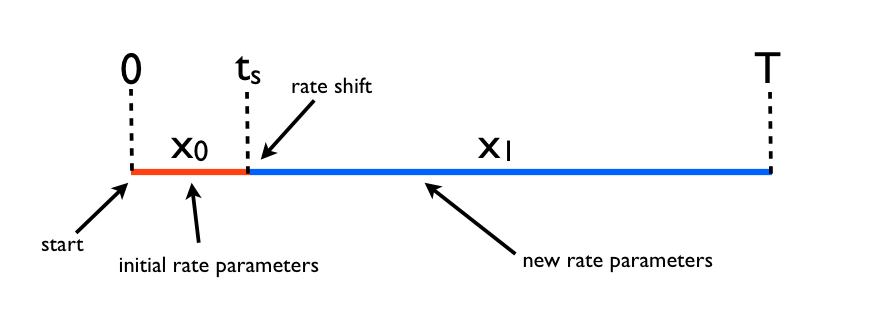
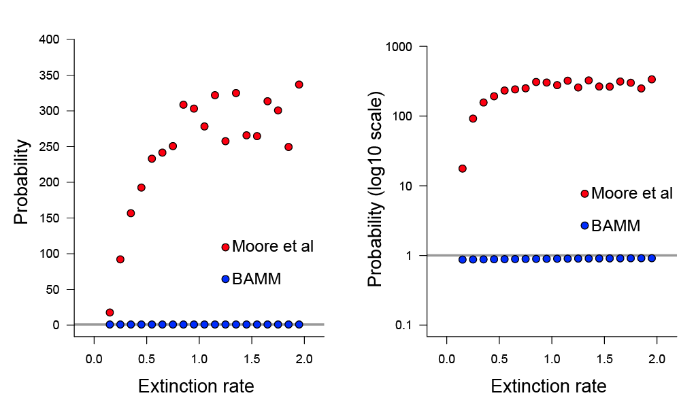

.. _mea_likelihood: 

Is the Moore et al (2016) likelihood a mathematically valid improvement?
=========================================================================================

Moore et al (MEA) contend that the BAMM likelihood is flawed, but do not justify their own likelihood equation (described in S2.2, p. S17 in MEA). We have previously acknowledged that the BAMM likelihood is an approximation to the true process, and have suggested that there is no *exact* method for computing the likelihood of rate shifts on phylogenetic trees (see this `page <likelihoodmodel.html>`_). **Here we show that the MEA likelihood contains a mathematical error, such that the resulting probabilities violate a basic axiom of probability theory.** Specifically, we express the MEA likelihood as a formal probability and demonstrate that it is not bounded on the interval (0, 1). MEA "probabilities" can become arbitrarily large (e.g., :math:`P(X) > 1`; :math:`P(X) \rightarrow \infty`). The BAMM likelihood does not show this property.

**If we have erred and the MEA approach can be shown to satisfy the formal definition of a probability, we will acknowledge this fact prominently on this page and leave the page here as evidence of our error, with appropriate explanation**. Our concerns about the MEA likelihood function follow our previous concerns that empirical analyses in the article cannot be `replicated as claimed <replication.html>`_. 

Summary
----------
 
* MEA validated their likelihood on *constant rate phylogenies*, where their method and BAMM give identical (and correct) results.

* **However, the MEA likelihood is incorrect if the tree contains rate shifts**. The MEA equations cannot compute a valid likelihood for any phylogenies that contain rate shifts.

* **"Probabilities" computed by MEA equations are unbounded and exceed unity (1.0) and thus fail the basic axiom of probability theory**, as seen in this :ref:`plot<probplot1>`. 

* Using MEA's Monte Carlo extinction simulator, we show that this problem results from a mathematical error in the algorithm used by the authors to compute likelihoods on phylogenies.

* We demonstrate that BAMM probabilities, computed in the same fashion, are correctly bounded on (0, 1).

* At present, it appears that **there is no available method that can compute the exact likelihood of a phylogeny with rate shifts.** BAMM uses an approximation to compute this likelihood and satisfies the basic axioms of probability theory. **The MEA equations do not satisfy these axioms.** As such, we cannot recommend the use of the MEA equations, which fail on even single branches in the presence of rate shifts.

**Intuitive explanation for failure of MEA likelihood:** To compute the likelihood of a rate-shift model, we must solve a pair of coupled differential equations, denoted by :math:`D(t)` and :math:`E(t)`. :math:`D(t)` describes the probability of the data, and :math:`E(t)` describes the probability of extinction of a single lineage between time *t* and the present. In their article (p. S17) and associated Dryad `code <http://datadryad.org/resource/doi:10.5061/dryad.mb0sd>`_, MEA use a data augmentation scheme to compute the likelihood of the data (as does BAMM; see p. S7). Unlike BAMM, however, MEA perform the augmentation only for the :math:`D(t)` equation and not for :math:`E(t)`. This invalidates the resulting :math:`D(t)` calculations and allows probabilities to increase :ref:`arbitrarily<probplot1>` to :math:`\infty`. To increase the transparency of our results, we provide a simple theoretical example illustrating how the MEA strategy of incomplete data augmentation would similarly compromise likelihoods for the :ref:`BiSSE<bisse1>` model. 
  
  
The MEA likelihood equation and computational algorithm
----------------------------------------------------------

BAMM and MEA compute the likelihoods of rate shift models under a data augmentation scheme, which is explained in S1.2.3 (p. 7) in MEA. The phrase *data augmentation* in this case refers to the fact that BAMM and MEA compute the likelihood of a mapped set of rate regimes across a phylogeny (e.g., each likelihood corresponds to an MCMC sample where rate shifts have been "painted" on the tree). This strategy makes the likelihood calculations much more tractable that the *non-augmented* strategy, which would compute branch likelihoods by integrating over all possible *unobserved* rate regimes. BiSSE (and related state-dependent models) use this latter approach, but the problem is tractable as there are a finite number of rate classes (:math:`n = 2` for BiSSE), and we know in advance which tips correspond to which rate classes (because of the character state data).

MEA and BAMM compute the likelihood by solving the following ordinary differential equations along each branch of the phylogeny:

.. math::

	\frac{dD_i}{dt} = -(\lambda + \mu)D_i(t) + 2 \lambda D_i(t) E_i(t)  
		
.. math::	
	\frac{dE_i}{dt} = \mu -(\lambda + \mu)E_i(t) + \lambda E_i(t)^2
  
where :math:`D_i` is the probability that a lineage in diversification regime *i* gives rise to the observed data. The term :math:`E_i(t)` is described in MEA as the probability that a lineage in state *i* at time *t* goes extinct before the present. The meaning of this term is somewhat different in BAMM, which we now explain briefly; this topic has already been treated on the BAMM website in great `detail <likelihoodmodel.html#what-exactly-is-the-process-modeled-by-bamm>`_ for some time.

Fundamental difference between MEA and BAMM algorithms
...........................................................

MEA and BAMM algorithms appear to use the same core equations (see p. S7 - S8 of MEA) to compute the likelihoods, but these are used in different ways. The meaning of the extinction probability, :math:`E_i(t)`, differs fundamentally between BAMM and MEA, and not merely because MEA attempt to account for unobserved rate shifts. Specifically:

* **MEA interpretation of E(t)**: In MEA, :math:`E_i(t)` is the probability that a lineage in state *i* goes extinct before the present, along with all of its descendants. The extinction probability **does not depend on any mapped rate shifts** (e.g., *data augmentation*) that occurs between time *t* and the present. As implemented, the MEA term attempts to account for unobserved rate shifts between time *t* and the present. Thus, **MEA fail to apply the same data augmentation to E(t) that they use for D(t)**

* **BAMM interpretation of E(t)**: In BAMM, :math:`E_i(t)` is the probability that a lineage in state *i* goes extinct before the present, along with all of its descendants, but is *conditional on the data augmentation* (e.g., the set of rate shifts that have been placed on the tree). Hence, BAMM's calculations are consistent, in that they use data augmentation for :math:`D(t)` and :math:`E(t)`.

To put this another way: the BAMM :math:`E_i(t)` terms must be computed in a similar fashion to the :math:`D_i(t)` terms, by traversing the tree recursively and **passing previously-computed extinction probabilities down the tree towards the root**. We have referred to this algorithm as *pass-down* on the likelihood `model <likelihoodmodel.html>`_  page. The MEA equations assume that :math:`E_i(t)` can be computed while ignoring downstream data augmentation, e.g., the extinction probability depends only on the current parameter values of the process. We have previously referred to the approach used by MEA as the *recompute* algorithm, because :math:`E_i(t)` can always be recomputed at any point on the tree knowing only the current state of the process at time *t*.

This is a difficult topic and has not been treated clearly in the literature. However, as we show below, the MEA approach is incorrect and does not compute valid probabilities when rate shifts are present. **The recompute algorithm is not valid for data augmented-histories**. 

The probability of a single branch with mapped rate parameters
------------------------------------------------------------------
Here we show that the MEA likelihood is invalid for a single lineage with a single rate shift. It is invalid -- as opposed to *biased* -- because the method computes probabilities that are not bounded on the interval (0, 1) and thus violates the definition of probability. This is not to say that the corresponding BAMM likelihood is *unbiased*, but we believe that any method for computing probabilities should satisfy the key axioms of probability theory.

As a test, we will compute the probability of the following lineage with a *data-augmented history* (e.g., a mapping of rate parameters to the tree).  

.. _rateshift1: 

 
Here, we have a single observed lineage (e.g., a branch of a phylogenetic tree) beginning at time :math:`t = 0` and ending at time :math:`t = T`. The process diversifies under an initial *red* set of parameters (:math:`\theta_0`) on time segment :math:`x_0`, undergoes a rate shift at time :math:`t_s`, and then survives to time T with a new *blue* set of a parameters (segment :math:`x_1`; :math:`\theta_0`). 
 
Expression as a formal probability
..........................................

The MEA likelihood of this branch history under MEA is simply :math:`p(x_0 | \theta_0) p(x_1 | \theta_1) \eta`, where :math:`\eta` is the rate at which rate shifts occur. This equation is not a formal probability, but simply by conditioning on the occurrence of a rate shift we can convert it to one. We will also condition this probability on survival of the lineage to the present, as is typical (survival must have occurred, or we would not be looking at a lineage history!). The probability of the data is thus:

.. math::

	p(x_0 | \theta_0) * p(x_1 | \theta_1) / (1 - E_0(0, T))
	
where :math:`E_0(0, T)` denotes the probability that a lineage in state 0 at time 0 goes extinct before the present, time T. Critically, the numerical integration for the differential equations describing :math:`E_i(t)` and :math:`D_i(t)` in MEA use the recomputed definition of :math:`E_i(t)`. The calculation is performed backwards down the lineage history, beginning at time T with initial values :math:`D = 1` and :math:`E = 0`. 

The BAMM calculation is different, because it does not use the recompute algorithm. The BAMM extinction probabilities computed on the interval :math:`x_0` and at the root account for the rate shift observed at time :math:`t_s`, thus ensuring that data augmentation used for the :math:`D(t)` calculation matches that used for :math:`E(t)`. Put another way, the extinction probability at the root under MEA depends only on parameters :math:`\theta_0` and the elapsed time :math:`T`, but the corresponding probability under BAMM depends on :math:`\theta_0`, :math:`\theta_1`, :math:`T`, and :math:`t_s`. 

Demonstration: failure of the MEA likelihood
................................................

The MEA likelihood is incorrect everywhere in parameter space if the chance of lineage extinction is greater than zero and if the phylogeny (or branch segment) includes data augmentation (e.g., mapped rate shifts). We will illustrate the inability of the MEA equation to compute a valid probability using parameters that we have selected precisely to illustrate this point; Here is a quick-link to a :ref:`figure showing our main results<probplot1>`. Our motivation for using *bad case* parameterizations is that they make clear that the MEA equations give rise to probabilities that can exceed unity. We consider it critical that any method, regardless of bias, be able to compute **probabilities** that are defined on the interval (0, 1). 

We attach here a :download:`script<mea_likelihood/MEA_analysis_script.R>` and :download:`functions<mea_likelihood/MEA_analysis_functions.R>` files to enable researchers to compute the probability of a single branch segment, as described above, with segments :math:`x_0` and :math:`x_1`. The code uses MEA's Monte Carlo extinction simulator to approximate the chance of extinction :math:`E_i(t)` as used in their article. To repeat all analyses below, you will need the MEA `Dryad supplement <http://datadryad.org/resource/doi:10.5061/dryad.mb0sd>`_ as well, where you can find the relevant code ("likelihoodFunctions.R" and "MonteCarloSimulator.cpp") in their directory ``supplementary_data/code/monte_carlo_simulation/``.  Our function, ``compute_MEA_probability``, takes the following arguments:

* ``pars0`` : vector of named parameters corresponding to the full process for the first branch segment, :math:`x_0`.

* ``pars1`` : vector of named parameters corresponding to the full process for the second branch segment, :math:`x_1`. 

* ``tvec`` : vector of times that describe the branch history, in the format c(:math:`t_0`, :math:`t_s`, :math:`T`). 

The ``pars0`` and ``pars1`` vectors contain the following named elements:

* ``lambda`` : the speciation rate for the focal interval

* ``mu`` : the extinction rate for the focal interval

* ``shiftrate`` : rate at which rate-shifts to new processes occur, corresponding to parameter :math:`\eta` in MEA (or :math:`\Lambda` in BAMM documentation)
 
* ``prior_lambda`` : the *rate parameter* of an exponential prior distribution on speciation rates for new processes (e.g., rate shifts lead to new rates that are sampled from this distribution)

* ``prior_mu`` : rate parameter for exponential prior on extinction rates for new processes

The ``prior_lambda`` and ``prior_mu`` values should be identical for the two ``pars`` vectors.

To parameterize the calculations, we will assume a very short segment :math:`x_0 = 1`, followed by a long segment :math:`x_1 = 49`. The initial parameters of the process will provide for high rates of extinction and speciation; the rate shift will lead to a lineage with very low rates of both speciation and extinction. We will set the ``rateshift`` parameter to be small, such that the frequency of rate shifts is low, and we will set the prior distributions for new speciation and extinction processes to have very small means, ensuring that new rate shifts are of small effect. We provide a demonstration of the failure of the MEA likelihood using our implementation (with their Monte Carlo simulator), and using their branch likelihood calculator exactly as distributed with their Dryad submission::

	require(deSolve)
	require(Rcpp)
	sourceCpp("MonteCarloSimulator.cpp")

	# functions required for the analyses:
	source("MEA_analysis_functions.R")

	pars1 <- c(0.001, 0.0009, 0.001, 50, 50)
	names(pars1) <- c("lambda", "mu", "shiftrate", "prior_lambda", "prior_mu")

	pars0 <- c(1, 1.1, 0.001, 50, 50)
	names(pars0) <- c("lambda", "mu", "shiftrate", "prior_lambda", "prior_mu")

	# initial segment of x0 = 1, rate shift, 
	#		then 49 time units to present with pars1
	tvec <- c(0, 1, 50)

	compute_MEA_probability(pars0, pars1, tvec)
		# should give approx 22

	compute_BAMM_probability(pars0 , pars1, tvec)
		# should give 0.50

**The MEA "probability" (prob = 22) is much greater than the bounding value (1) for valid probabilities.** These results are not simply a function of our independent implementation of the MEA equations. Here, we repeat this calculation using the functions distributed with MEA's Dryad submission::

	sourceCpp("MonteCarloSimulator.cpp") 
	# this file from MEA Dryad, supplementary_data/code/monte_carlo_simulation/
	# add Moore et al likelihood functions

	source("likelihoodFunctions.R") 
	#this file from MEA Dryad, supplementary_data/code/monte_carlo_simulation/

	# our file, contains wrapper for MEA functions
	source("MEA_analysis_functions.R")

	MEA_prob_PNAS_implementation(pars0, pars1, tmax=50, tshift = 1)  
	# gives approximately 34, e.g., something much greater than 1

We get approximately 34 with the MEA implementation, which is obviously greater than the true limit on a probability. Your results may differ slightly from those presented above: these differences are due to stochastic variation in the extinction probabilities simulated using the MEA Monte Carlo simulator. However, increasing the precision of the approximation through increased numbers of simulations does not change the basic results presented above. Differences in numerical precision from the integrators used by us (``deSolve::ode``) and MEA explains much of the discrepancy in values between the MEA probability as computed with our implementation (``compute_MEA_probability``) and their implementation (``MEA_prob_PNAS_implementation``). For this particular example, the overall extinction probability of the process is so high that small differences in the numerical integration (say, :math:`E(t) = 0.999` versus :math:`E(t) = 0.9991`) can lead to differences between probabilities computed using the MEA code versus our implementation. However, as we discuss below, the results shown here do not result from numerical instability.

Now, we will slightly reparameterize things to see how BAMM and MEA probabilities perform across a range of speciation and extinction rates. Here, we will simply fix the relative extinction rate :math:`\mu / \lambda` to 0.999, and explore speciation rates between 0 and 3. The plot below shows the BAMM probabilities for the single branch (blue dots) and the MEA probabilities are shown in red.

.. _probplot1: 
.. figure:: mea_likelihood/probabilityplot1.png
   :width: 400
   :align: center  

Again, MEA probabilities consistently exceed 1. Indeed, we can cause these values to become arbitrarily large by simply manipulating the initial (root) values of speciation and extinction. Here, we will use the same shift time and ``pars1`` settings (and rate shift process settings) as above, but will manipulate the initial extinction value. We will set :math:`\lambda = 0.1` and iterate over a set of :math:`\mu` values between 0.2 and 2 (this code is all available in the :download:`script<mea_likelihood/MEA_analysis_script.R>` and :download:`function<mea_likelihood/MEA_analysis_functions.R>` files):

.. _probplot2: 

These plots are showing identical data, but the right side shows the probabilities on a log10 scale. The BAMM probabilities approach but do not exceed 1. Note that in the MEA probability calculations, their Monte Carlo simulator was used to estimate the extinction probability :math:`E(t)`, so the pathologies evident in their probability model cannot be explained by failure to account for rate shifts on extinct lineages. The MEA equations lead to excessively large probabilities in these examples because the unconditioned probability of the data (the numerator, :math:`D(t)`) becomes larger than the probability that the process does not go extinct, denominator (:math:`1 - E(t)`). 

These results are not a function of numerical instability
...........................................................

These results are not simply a reflection of numerical instability; we illustrate the problem with incomplete data augmentation using a more conceptual :ref:`BiSSE-based<bisse1>` example below. Moreover, the same results can be repeated with parameterizations leading to :math:`E(t)` values at the root that are far from numerically unstable boundaries, as occurs when :math:`E(t) \rightarrow 1`. For example, here is a parameterization that gives modest extinction probabilities at the root (:math:`E(t) \approx 0.715`) but nonetheless gives "probabilities" for the process that exceed 1::

	pars1 <- c(0.001, 0.0009, 0.001, 50, 50) # as above
	names(pars1) <- c("lambda", "mu", "shiftrate", "prior_lambda", "prior_mu")	
	
	# some reasonable values for x0 segment:
	pars0 <- c(0.1, 0.08, 0.001, 50, 50) 
	names(pars0) <- c("lambda", "mu", "shiftrate", "prior_lambda", "prior_mu")
	tvec <- c(0, 1, 50)
 
Here is the extinction probability under the MEA Monte Carlo simulator::
 
	x <- replicate(1e5, SimulateCPBDP(50, pars0["lambda"], 
			pars0["mu"], pars0["shiftrate"], pars0["prior_lambda"], pars0["prior_mu"])) 

	mean(x < 50)
	# = 0.715, far from potential boundary effects at 0 or 1
 
And finally, the corresponding probabilities of the data, which must be bounded on (0, 1)::
 
	compute_MEA_probability(pars0, pars1, tvec) # = 2.6
	compute_BAMM_probability(pars0 , pars1, tvec) # = 0.87

The MEA equations still yield invalid probabilities, even under parameters that are far from boundaries that might yield numerically unstable calculations. In fact, it is trivial to show that the same pathologies illustrated here apply to the special model where we disallow rate shifts on extinct branches, if the MEA strategy of incomplete data augmentation is used. Here, for example, we will use *an exact analytical solution* to the birth-death process to compute probabilities under the MEA data augmentation strategy but under the assumption that no rate shifts occur on unobserved lineages (e.g., there is no use of the MEA Monte Carlo extinction simulator)::
	
	source("MEA_analysis_functions.R")
	# using parameters from the previous example:
	compute_MEA_analytical_noExtinctShifts(pars0, pars1, tvec)
	# gives 3.1

This latter MEA-type probability is strictly analytical and includes no stochastic simulation of extinction probabilities, and no numerical integration to solve the relevant ODEs. Hence, there is no numerical error associated with this value.	
 
These results are not a function of inappropriate conditioning
.................................................................
The root (initial) state is assumed to be known under the data augmentation; there is no justification for weighting root states by equilibrium frequencies during the conditioning. In their article, MEA perform the same conditioning that we use in the examples above.

.. _bisse1:

Failure of incomplete data augmentation ("recompute") with BiSSE
---------------------------------------------------------------------------
The pathologies observed here for the *recompute* algorithm used by MEA are not unique to BAMM-type rate shift models. In fact, any diversification model that uses data augmentation (mapped rate shifts) will fail if the data augmentation is not applied to both the :math:`D(t)` and :math:`E(t)` calculations. Here, we will show that the incomplete strategy of data augmentation leads to invalid probabilities when applied to the BiSSE model. This is a nice analytical test case, because here there is no question about the effects of rate shifts on unobserved lineages: the BiSSE model specifies that there are exactly 2 rate classes, and we have a formal stochastic process for transitioning between them. Moroever, **we do not have to worry about whether the MEA Monte Carlo simulator is correct** because we can compute the exact extinction probability for an unobserved lineage that may or may not undergo a rate shift.

Here, we will show again the single branch segment, the probability of which we will compute under BiSSE with data augmentation: 

.. _rateshift2: 

As before, we will assume we have a :math:`\lambda_0`, :math:`\mu_0` parameterization on the first :math:`x_0` segment, then a rate shift, and a :math:`\lambda_1`, :math:`\mu_1` parameterization on the second segment. We will assume the following generic parameter values:

* :math:`\lambda_0` = high
* :math:`\mu_0`  = even higher
* :math:`\lambda_1`  = 0
* :math:`\mu_1`  = 0
* :math:`q_{01}`  = low
* :math:`q_{10}` = 0

The probability of the data, under *recompute*, is as given above and is conditioned on (i) survival of the process to the present, and (ii) the occurrence of a transition event at time :math:`t_s`. 

The relevant ODE for the probability of the data on segment :math:`x_1` is:

.. math::

	\frac{dD_1}{dt} = -(\lambda_1 + \mu_1 + q_{10})D_1(t) + 2 \lambda D_1(t) E_1(t)  

and extinction equations
		
.. math::	
	\frac{dE_1}{dt} = \mu_1 -(\lambda_1 + \mu_1 + q_{10})E_1(t) + \lambda E_1(t)^2 + q_{10}E_0(t)
	
	\frac{dE_0}{dt} = \mu_0 -(\lambda_0 + \mu_0 + q_{01})E_0(t) + \lambda E_0(t)^2 + q_{01}E_1(t)	
	
and the corresponding probability of the data on segment :math:`x_0` is:

.. math::

	\frac{dD_0}{dt} = -(\lambda_0 + \mu_0 + q_{01})D_0(t) + 2 \lambda D_0(t) E_0(t)  

These equations account for all events that could have occurred while yielding a single branch with mapped rate parameters. These equations also include the full stochastic process that can give rise to new lineages, and there is thus no need to use any Monte Carlo approximations to the extinction probability. For some added notational clarity below, we will write extinction probabilities computed using the above equations as :math:`E_i(t_1, t_2)` to denote the probability that a single lineage in state *i* goes extinct (along with all of its descendants) on the interval :math:`t_1` to :math:`t_2`. The algorithm to compute the full probability of the segment under the recompute algorithm is:
	
* Compute probability for segment :math:`x_1`  using the equation for :math:`D_1(t)` above and with initial values :math:`D(0) = 1` and :math:`E(0) = 1`.   

* Compute the probability for segment :math:`x_0` using the equations for :math:`D_0(t)`, initializing D with the previously-computed probability of segment :math:`x_1`, and with the initial extinction probability equal to :math:`E_0(t_s, T)`.  That is, the initial extinction probability is the probability that a single lineage alive at the time of the shift :math:`t_s` and in state 0 goes extinct before the present, along with all of its descendants. 

* Compute the extinction probability of the full process, for conditioning. This is the probability that a lineage at the start of the process (t = 0), in state 0, goes extinct before the present, or :math:`E_0(0, T)`.

Given the parameterizations we have here, we can note the following:

* The probability of segment :math:`x_1 = 1`, because there are no events that can occur that can change the initial probability of the data (1).

* The probability of segment :math:`x_0` can take any value, but - as the time interval :math:`x_0` shrinks to a very short duration - the probability approaches the limiting value (1). Given that you start with probability 1, you can make time so short that the probability of events occurring is sufficiently small that this probability can become approximately equal to 1.  

* The probability of extinction at the root, :math:`E_0(0, T)`, can easily approach 1 as well. This will occur because transitions to state 1 (:math:`q_{01}`) are rare, and the initial parameters for state 0 make extinction highly probable over the full (0, T) duration of the process (e.g., high :math:`\lambda_0` and even higher :math:`\mu_0`). 
 
The conditioned probability is obtained by dividing the probability of the data (the lineage history) by the probability that the process survives to the present, or :math:`1 - E_0(0, T)`. This term can approach 0 within the limits of machine precision, depending on parameter values. Hence we have, for the full "probability":

**(something approaching 1)** divided by **(something approaching 0)**

= **something arbitrarily larger than 1**.

Using these equations, the probability of the data can easily exceed 1. These results reflect the same underlying pathology in the MEA likelihood equations, because in both cases, the likelihood fails to perform a complete data augmentation to :math:`D(t)` and :math:`E(t)`. These problems do not occur with the approximation used in BAMM, because the calculation accounts (albeit imperfectly) for modifications to :math:`E(t)` that are attributable to downstream rate shifts, through the "pass-up" and "multiply" approaches to the calculations described on the BAMM `likelihood page <likelihood.html>`_.
 

