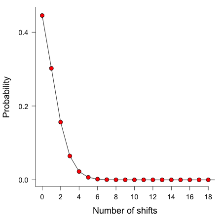
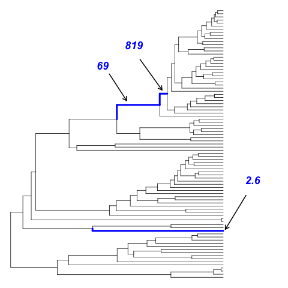
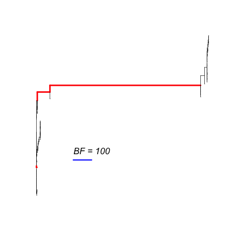
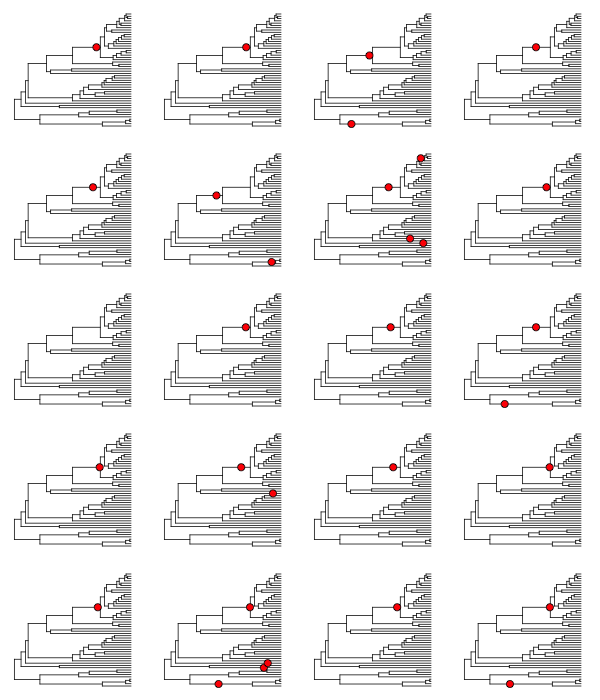
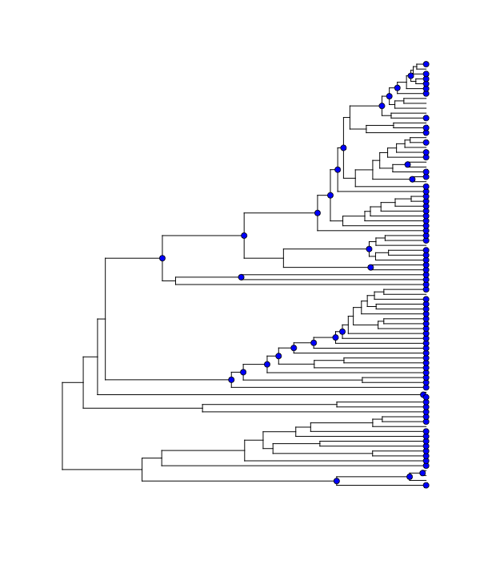
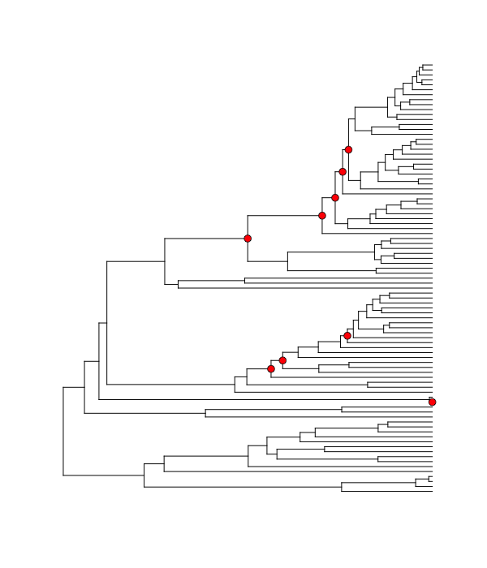

.. _rateshifts: 

Rate Shifts on Phylogenies: Theoretical Background
==================================================

This section details some of the most common conceptual issues that can arise when interpreting rate shifts on phylogenetic trees. Many studies have attempted to identify ***the*** rate shifts within a given dataset. In the BAMM framework, there is no single set of independent rate shifts waiting to be identified. Rather, BAMM identifies *configurations* of rate shifts - sets of shifts that are sampled together - and enables us to compute relative probability of those configurations. Three *shift configurations* sampled with BAMM during simulation of the posterior are shown :ref:`here<bammgraphgallery2>`.
 
Many features and analyses with BAMM and BAMMtools **will not be clear** unless you have a good understanding of the concepts below. It is especially important to grasp the idea of *distinct shift configurations* and *marginal shift probabilities*.
 
The BAMM model is an approximation
..................................

The models of diversification and trait evolution implemented in BAMM are approximations. This is true for any statistical model that you can use to extract information from data. Let's consider a few assumptions of the models implemented in BAMM. The model assumes that a relatively small number of discrete shift events can explain the data (sort of.... it is more that the marginal likelihood of any particular model is implicitly penalized by the addition of more parameters).It is possible that many shifts in evolutionary dynamics change in a discrete fashion (e.g., the classic "key innovation" scenario), but it is also possible that major changes in dynamics occur through a number of sequential changes in some general region of a tree (see figure below).

.. _shifts1: 
.. figure:: figs/x_interpret1.png
   :width: 700
   :align: center

This is the cetacean phylogeny (try ``data(whales)`` to load this tree) included as an example dataset with BAMMtools, and you can see some examples of rate variation across this tree :ref:`here<bammgraphgallery1>`. The tree on the left depicts the maximum shift credibility configuration identified by BAMM. This is simply the shift configuration sampled during simulation of the posterior with the highest marginal probability, analogous to the "maximum clade credibility tree" sampled during a Bayesian phylogenetic analysis (see below). The tree on the right gives an alternative interpretation of the results that would be invisible in the BAMM framework. Here, a relatively minor set of evolutionary shifts combine to produce - over several branches (red) - a major shift in evolutionary dynamics.

The point is that BAMM - and every other model that assumes discrete shifts in dynamics - can only detect discrete shifts in dynamics. Strictly speaking, this is less of a limitation for BAMM than other approaches. Because BAMM explicitly allows rates to vary through time after the point occurrence of a shift, the model does a reasonable job of tracking some types of continuous variation in evolutionary rates. In general, though, a spike in evolutionary rates inferred along a particular branch is fully consistent with the possibility that the "true" process involved a relatively continuous acceleration in rates that occurred over several branches. More generally, it is unlikely that such a continuous acceleration scenario over a relatively short period of time (e.g., tree on right) can even be detected from the sort of data we typically have available to us.

This is not a weakness *per se* of BAMM, and it applies to all other "macroevolutionary" scale modeling frameworks of which we are aware. However, recognizing the limitations of the discrete shift framework has a number of practical implications for interpreting patterns in data.  

Multiple distinct rate shift configurations can explain your data
.................................................................

With most phylogenetic datasets, it is unlikely that you will be able to identify the specific branches on which rate shifts have occurred with extremely high confidence. More typically, you will be unable to exclude several different shift configurations that potentially account for a given pattern of phylogenetic branching or phenotypic diversity. 

Currently, stepwise AIC and other model selection approaches are used to identify a single best set of rate shifts. We will single out some work that we have previously been involved with as an example of this type of approach. In Rabosky et al. (Proc. R. Soc. B, 274:2915-2923, 2007) and Alfaro et al. (PNAS 106:13410-13414, 2009), an information-theoretic model selection procedure is used to fit a set of models to phylogenetic data. Model complexity starts at 0, with the assumption that a single set of evolutionary rate parameters apply across an entire phylogeny. The algorithm then considers a more complex model, with two distinct evolutionary rate partitions across the tree. The actual likelihoods and AIC scores reported in these papers (and most subsequent papers that have cited them) tell us only about the relative fit of a model with *X* rate shifts relative to a model with *Y* rate shifts. There is typically no information in these analyses that provides the relative probability of different rate shift :ref:`configurations<bammgraphgallery2>`. All we get is the maximum likelihood *point estimate* of the best-fit shift configuration, but we get no information regarding our confidence in that estimate relative to other shift configurations with an identical number of rate shifts. 

Here's a graphical illustration of the logical problems associated with this. Suppose you analyze a particular phylogeny and find that a model with 2 distinct rate regimes fits the data better than a single rate regime with probability 1.0. You report the location of your rate shift identified using the stepwise procedure as follows:
 
.. figure:: figs/xFig2a.png
   :width: 600
   :align: center

You go on to discuss this as strong evidence for a rate increase along the branch leading to clade A. You propose several potential key innovations that may have occurred along the branch leading to clade A that can potentially account for this discrepancy in species richness between clades A and B. 

The problem here is that you have confounded statistical evidence for the **number of rate shifts** with statistical evidence for the **location of the rate shifts**. These are not the same. In fact, you have merely reported a single *point estimate* for a rate shift location that is consistent with your data. The true evidence for your rate shift locations might look more like this:

.. _toyshifts: 
.. figure:: figs/xFig2b.png
   :width: 600
   :align: center

Here, you can see that - despite overall strong evidence for the occurrence of a rate shift *somewhere* in your tree - you can't distinguish between several **very different** scenarios that have roughly equal probability. You can arrive at the observed disparity in diversity between clades A and B by (1) having a rate increase on the branch leading to clade A, or (2) a rate decrease on the branch leading to clade B. Unfortunately, there is nothing in your stepwise model-selection framework that provides this information. And these two scenarios lead to very different biological interpretations.

Simply speaking, reporting only the *maximum likelihood* shift location on a phylogenetic tree is exactly the same as publishing a single "best" estimate of a phylogeny with no measures of clade support. This would never be acceptable in the phylogenetic literature: at a minimum, we require bootstrap evidence, posterior probabilities, decay indices, or some other measure of the robustness of a particular inferred topology. However, in studying macroevolutionary dynamics, we frequently do *exactly what we would never do in phylogenetic biology*: we present point estimates with no probabilistic support measures, and we have mistaken support for a particular **number of shifts** for support bearing on their location.

Addressing this issue is one of the primary reasons that we created BAMM.

Is this really an issue with real datasets?
-------------------------------------------
 
**Yes**.

We have encountered very few datasets where signal of a shift in rate dynamics along a particular branch is so strong that we can exclude alternative shift configurations with probability > 0.95. 

Consider the analysis of whale diversification, which we've included as an example dataset in BAMMtools. We also use this dataset as an empirical example in the primary description of the BAMM model. The figure below shows reconstructed speciation rates through time during the whale radiation (red = fast, blue = slow) under BAMM. Overall, the model with the highest posterior probability had two rate dynamics, and a model with just a single rate dynamic had a posterior probability approaching zero. The marginal (branch-specific) probabilities of a rate shift occurring on the 3 most likely branches are as follows:
 
.. _whalemarg1:  
.. figure:: figs/xfig3a.png
   :width: 650
   :align: center

Overall, we have very strong evidence for a shift in diversification dynamics somewhere near the origin of the dolphin clade, and the probability that at least one of the shifts illustrated above occurs is greater than 0.99. Although we are confident that a shift in dynamics **has** occurred, we cannot pin down a precise location of the shift. It would be incorrect to assert that the shift occurred on the branch with the highest marginal probability; it is almost as likely (p = 0.43) that the shift occurred on one of the ancestral branches immediately preceding the origin of the dolphin clade. 

Rate shifts are not independent
...............................

Marginal shift probabilities - the probability that a shift occurred on a given branch, ignoring everything else in the tree - are useful, but they are **not independent** of shifts occurring elsewhere on the tree. The marginal shift probabilities in the figure :ref:`above<whalemarg1>` cannot be treated as independent. In fact, the joint probability of a shift occurring on any two of the 3 principal branches (e.g., those with probs 0.05, 0.38, and 0.56) is approximately zero for all combinations. In other words, if you have a shift on one of these 3 branches for a given sample from the posterior, the conditional probability of a shift on any of the other branches leading to the dolphin clade is approximately zero. 

Put simply: there is very strong (prob > 0.99) evidence for a shift in dynamics somewhere along the ancestral 3 branches leading to the core dolphin clade. But there is only evidence for one such shift. Almost every sample from the posterior has a shift on at least one of these 3 branches, but no sample has a shift on more than one of these branches. 

Because of the non-independence of rate shift configurations, it doesn't really make sense to show - in a single tree - all the rate shifts discovered by BAMM. A good (but imperfect) analogy for thinking about rate shift configurations and their potential non-independence comes from Bayesian phylogenetic analysis. Any given shift configuration is like a phylogenetic tree sampled from a posterior. Some trees in that posterior will be incompatible with others. Trying to show all the rate shifts at once on a single tree, or reporting them as though they are independent, is sort of like trying to show a phylogenetic tree where you show all recovered clades at the same time. Suppose in a Bayesian phylogenetic analysis of 3 clades (A, B, C) you recover, each with probability 0.5, the following topologies: (A,(B,C)) and ((A,B),C). These topologies are incompatible, and it doesn't make sense to demand a single phylogenetic tree that represents all sampled clades within a single tree. The solution in phylogenetics is to collapse these incompatible topologies to a consensus tree with a polytomy. Showing all rate shifts recovered with BAMM on a single phylogenetic tree is a bit like showing a consensus phylogeny with polytomies: it isn't the "true" tree, but it summarizes some of the total run information.

Analysis of rate shifts in the BAMM framework
...........................................................

There are many types of information that can be extracted from a BAMM run. Here we describe several useful methods of summarizing and visualizing shift information from a BAMM analysis.

Shift configurations sampled with BAMM
--------------------------------------

One of the most important ideas to grasp regarding BAMM is that BAMM simulates a posterior distribution of *shift configurations* on phylogenetic trees. Hence, every sample from a posterior simulated with BAMM may contain a potentially unique configuration of rate shifts. Here are 3 different shift configurations for the primates dataset included in BAMMtools. The fourth tree is a phylorate plot, showing instantaneous (marginal) phenotypic evolutionary rates at a fine-grained set of points along the phylogeny. Note that the shift configurations are different for each sample from the posterior. 

.. _primateconfigs:  
.. figure:: figs/xprimates_shiftconfigs.png
   :width: 650
   :align: center

Marginal shift probabilities
----------------------------

The marginal shift probabilities on individual branches across the tree are of considerable interest. As discussed above, there are some nuances to interpreting these, because the probability associated with a shift on any particular branch is not independent of other branches in the tree. The following snippet of R code will compute the marginal shift probabilities for each branch in one of the example datasets included with BAMMtools. It is not necessary to understand (or even run) this code yet; we will cover BAMMtools in much greater depth in subsequent sections. 

If you don't have BAMMtools installed and/or don't know how to install it, you may wish to read the first few paragraphs of :ref:`this section<bammtools>`. First, we load BAMMtools::

	library(BAMMtools)

Now, we load two datasets included with BAMMtools: a time-calibrated phylogenetic tree of living whales (``whales``), and an output file from our BAMM analysis (``events.whales``). We will load these using the ``data`` function in R::

	data(whales)
	data(events.whales)
	
Now we convert the phylogeny and BAMM output file into a particular data object that is at the heart of BAMMtools analyses::
	
	ed <- getEventData(whales, events.whales, burnin=0.1)
	
Object ``ed`` is now a ``bammdata`` object. Finally, we can compute the marginal shift probabilities for this phylogeny::	
	
	marg_probs <- marginalShiftProbsTree(ed)

The object ``marg_probs`` is a copy of the original phylogenetic tree, but where the branch lengths have been replaced by the branch-specific marginal shift probabilities. In other words, the length of a given branch is equal to the percentage of samples from the posterior that contain a rate shift on that particular branch.

You can convey this information in several possible ways. You can directly indicate marginal shift probabilities on a phylorate plot, as shown :ref:`here<whalemarg1>`. You can plot your ``marg_probs`` tree itself: the branches are scaled directly by probabilities, so a tree plotted in such a fashion conveys quite a bit of information (see Figure 9 from `Rabosky 2014 <http://www.plosone.org/article/info%3Adoi%2F10.1371%2Fjournal.pone.0089543>`_ for an example of such a plot). You could create such a plot by simply executing::
	
	plot.phylo(marg_probs)
		
in R. You can potentially color branches by their marginal shift probabilities, or you could add circles to each branch with a shift probability greater than some threshold.

But don't get hung up on the fact that your shift probabilities are less than 0.95. Even *very* strongly supported rate heterogeneity will generally be associated with marginal shift probabilities < 0.95. As discussed :ref:`here<whalemarg1>`, you can (and often will) have exceptionally strong evidence for rate heterogeneity even if any given branch has marginal shift probabilities that do not appear particularly high. **Marginal shift probabilities tell you very little about the probability of rate heterogeneity in your dataset**. In principle, you could have high confidence that your data were shaped by a very large number of rate shifts, but at the same time find that no single branch has a marginal probability exceeding 0.10. 

The prior probability of a rate shift 
------------------------------------------------------------

The BAMM model assumes that the number of rate shifts on a phylogeny is an outcome of a stochastic process. There is a prior probability associated with each outcome of this process, and the parameter ``poissonRatePrior`` that you specify in your BAMM analyses determines what these probabilities are. It is important to understand this, because you can manipulate this prior distribution to obtain large numbers of rate shifts on your tree, even where there is very little evidence for them in the data. By default, BAMM will simulate the prior probability distribution on the number of rate shifts for your data using whatever value of ``poissonRatePrior`` you give it. For the whales example analysis included in BAMMtools, the prior distribution was generated with ``poissonRatePrior = 1.0``. This defines a distribution that looks like this: 

.. _prior1:  

Now, suppose we set ``poissonRatePrior = 0.1``. This flattens our prior distribution, such that our expected number of rate shifts under the prior alone looks like this:

.. _prior0.1:  
.. figure:: v2rcode/rateshifts_prior_0.1.png
   :width: 380
   :align: center

Practically speaking, if you are to set ``poissonRatePrior = 0.1``, this means that *even without diversification rate variation in your tree*, you would potentially observe significant evidence for diversification rate heterogeneity if you considered posterior probabilities alone. In fact, under the prior alone (``poissonRatePrior = 0.1``), the prior probability of 0 rate shifts is approximately 0.024. This is one reason why we emphasize the utility of :ref:`Bayes factors <bayesfactors>` for model selection in BAMM. 

There are very good reasons to **not** use a super-conservative prior in a BAMM analysis. The more restrictive the prior, the more difficult it will be for BAMM to achieve convergence. If you really do have evidence for 20 rate shifts in your data (typical for trees with several thousand or more tips), then using a value of ``poissonRatePrior = 10`` will make it very hard to find this region of parameter space. Basically, for BAMM to find rate shifts, the algorithm must be able to propose and accept new shifts. If the prior is too restrictive, you will reject most moves that increase model complexity.

What this means, however, is that every branch in your tree will have a non-zero expected number of rate shifts *no matter what prior you choose*. How many rate shifts would you expect on any particular branch? The easiest way to think about this is to consider the figures above and imagine that those shift counts are smeared uniformly across the entire tree. Consider the whale dataset with ``poissonRatePrior = 1``. In this case, the expected number of shifts under the prior is::

	sum(prior.whales$N_shifts * prior.whales$prob)
	# should give roughly 0.95
	
This is the average number of shifts we should observe across the whole tree under the prior. So, if the sum of all branch lengths in our tree is *S*, the expected fraction of total shift events that should occur on a given branch is equal to the branch length divided by *S*. If your expected number of shifts under the prior is 2.0, and the sum of all branch lengths is 5.0, a branch of length 1.0 time units will, on average, contain *5 x 0.2 = 1* shift under the prior alone. A critical point is that under the prior, the distribution of shifts is uniform across the tree. 

This leads to one major difficulty with the interpretation of marginal shift probabilities: these probabilities will depend on the Poisson rate prior we choose for our analysis. And just as importantly, they will depend on the branch length. Because the expected number of rate shifts under the prior is uniform, we expect to observe more shifts on long branches than short branches, just by chance alone. If we want to identify the branches that have the strongest evidence for **significant and substantial** rate shifts, then it makes sense that we should take the prior into account when evaluating shift probabilities on individual branches.  
	
We feel that this is issue is sufficiently important that we have made addressing this challenge a major feature of BAMMtools 2.0.	

Bayes factors as evidence for rate shifts
---------------------------------------------

.. _bayesfactorbranches:

Our solution to the problem above is to compute a *Bayes factor* associated with evidence for a rate shift, for each branch in our phylogeny. This is a nice solution that has a natural Bayesian interpretation and accounts for the effects of the prior and branch length on our perceived evidence for a rate shift. We thank 
`Jeremy Brown <http://www.phyleaux1.lsu.edu>`_ for suggesting the use of Bayes factors in this context.

Here, we will consider a worked example using the whales dataset that is distributed with BAMMtools. The basic idea is to imagine that, in the context of a BAMM analysis, each branch can be described by one of two models: either there is a rate shift on the branch, or there is no rate shift on the branch. Let's compute the marginal shift probabilities on the whale phylogeny::

	data(whales, prior.whales, events.whales)
	edata <- getEventData(whales, events.whales, burnin=0.1)
	margprobs <- marginalShiftProbsTree(edata)

We will now look carefully at the 3 branches with the highest marginal shift probabilities in the whale analysis. Here they are, plotted:

.. _bayesfactorbranches1:  
.. figure:: v2rcode/bayesfactorbranches1.png
   :width: 380
   :align: center

These are posterior probabilities of shifts on three individual branches (and, in ape node format, these are nodes 16, 140, and 141). But what about the prior probabilities of a rate shift on those branches? BAMMtools has a function that uses the simulated prior distribution to compute prior probability of a rate shift on any given branch (there is a short appendix :ref:`here<appendix1>` that shows how this is done). In BAMMtools, we could just do::

	data(prior.whales, whales)
	branch_priors <- getBranchShiftPriors(whales, prior.whales)

The object ``branch_priors`` is now a copy of our phylogenetic tree, but where each branch length is equal to the *prior* probability of a rate shift. Here are the prior probabilities for the 3 branches identified above as having elevated marginal shift probabilities:
 
.. _bayesfactorbranches2:  
.. figure:: v2rcode/bayesfactorbranches2.png
   :width: 380
   :align: center

Note that the prior probability of a shift is proportional to the branch length. The longest branch, with a marginal (posterior) probability of 0.06, also has the greatest probability of a shift expected under the prior alone (*prob = 0.025*). But the shortest branch is the one with the lowest overall prior probability. In fact, our prior expectation is that we are 25 times more likely to see a shift on the long branch relative to the short branch. We will now compute branch-specific Bayes factors associated with a *rate shift* relative to *no rate shift*. 

Let :math:`P_S` denote the posterior probabilities of either observing a shift on some particular branch, and let :math:`\pi_S` denote the corresponding prior probability of a shift on that branch. The posterior probability of no shift (:math:`P_{NS}` is just :math:`P_{NS} = 1 - P_S`, and the prior probability of no shift (:math:`\pi_{NS}`) can be computed the same way. The Bayes factor evidence for a *rate shift* relative to *no rate shift* is given by

.. math::

	BF_{SHIFT} = \frac{\frac{P_S}{\pi_S}}{\frac{P_{NS}}{\pi_{NS}}} = {\frac{P_S}{(1 - P_S)}}{\frac{(1 - \pi_S)}{\pi_S}}	

This quantity has an appealing intuitive interpretation. It is a measure of the posterior odds of two models (shift versus no shift), normalized by their prior odds ratio. Values of 20 or so imply reasonably strong support for one model over another. One way to think about this is to imagine a scenario where the posterior probability of a rate shift on a branch is 0.95, and the prior probabilities of shift and no shift are equal (:math:`\pi_S = 0.5`). The Bayes factor in favor of a rate shift would just be 0.95 / 0.05, or 19. Because the "null model" (no rate shift) has a posterior probability of 0.05, we can (very loosely) relate this Bayes factor to a traditional p-value in classical hypothesis testing: a Bayes factor of approximately 20 corresponds approximately to a null hypothesis p-value (no shift) of 0.05. BAMMtools enables us to easily compute the Bayes factor evidence for a rate shift on each branch of our phylogeny::

	data(prior.whales, whales, events.whales)
	edata <- getEventData(whales, events.whales, burnin=0.1)
	branch_priors <- getBranchShiftPriors(whales, prior.whales)
	bf <- bayesFactorBranches(edata, branch_priors)

The object ``bf`` is now a copy of our phylogenetic tree where the branch lengths have been scaled to equal the corresponding Bayes factor. Let's go back to the whale tree and look at the Bayes factor evidence for a rate shift on the 3 branches with the highest marginal shift probability:

.. _bayesfactorbranches3:  

You can see that the Bayes factor evidence provides a clearer interpretation of these shift probabilities. This shows that the branch with the strongest evidence for a rate shift is, by far, the shortest branch overall. Bayes factors of this magnitude (> 800) are very strong evidence in favor of a model with a rate shift on this branch. The marginal shift probabilities for the 2 branches at the top aren't all that different (0.37 and 0.55), but - relative to their prior expectation - there is much stronger evidence for a shift on the short branch. Conversely, our perception of already-weak evidence for a shift on the long branch (marginal probability = 0.06) drops even further, as it now has a Bayes factor of 2.6 (not worth mentioning). In fact, we can redraw our phylogeny, scaling each branch length by the Bayes factor support for a rate shift. We simply plot the object returned by ``bayesFactorBranches`` with ``plot.phylo``:

.. _bayesfactorbranches4:  

This is the same tree as above, and we have highlighted the same 3 branches. The blue scale bar denotes a length of 100 Bayes factor units. All of this is background to appreciating perhaps the most important concept in a Bayesian analysis of diversification: the notions of **distinct shift configurations** and **credible shift sets**. 

.. _coreshifts:

Identifying the distinct shift configurations
---------------------------------------------
For any given phylogenetic tree, there are many possible **topologically distinct shift configurations**. A topologically distinct shift configuration on a phylogeny is one that is distinguishable from all other shift configurations by the presence or absence of a rate shift on at least one branch. The total possible number of **distinct shift configurations**, or *D*, for a given tree with *N* branches is simply

.. math::
	D_N = \sum_{k = 0}^{N}\dbinom{N}{k}
 
This includes one shift configuration for the case where there are no rate shifts, one configuration for the case where every branch has a rate shift, and all combinations between those two extremes. This is a large number for real phylogenies. 

If you were to run BAMM until the end of time, you could theoretically obtain at least one sample of every single topologically distinct shift configuration. This immediately follows from the fact that all branches have non-zero prior probabilities of rate shifts (see above if this is not clear!). If we were to enumerate every single **distinct shift configuration** from a typical BAMM analysis, we would end up with a very large set of shift configurations. Often, this number would be nearly equal to the number of samples we have obtained from our posterior! 

What you really care about are the **important** rate shifts, not random events that are simply a result of prior expectations. The solution we have adopted in BAMM 2.0 is examine each branch in a phylogenetic tree and determine whether it contains a *potentially significant* or *trivial* rate shift. We use an explicit Bayes factor criterion to determine which rate shifts have marginal probabilities that are elevated relative to the prior expectation. 

To illustrate this, here is a plot of 20 random shift configurations from a BAMM analysis of the whale dataset (using a slightly reduced taxon set from the function ``subtreeBAMM``). 

.. _distinctshiftconfigurations1:  

 
If you look carefully, you'll see that there are a few shifts that pop up more frequently than others, and a number of shifts that show up just once. Remember, any sample from the posterior has a reasonable chance of including rate shifts of no significance - e.g., shifts that are no more common than you would expect by chance alone under the prior. This next plot shows all shifts that occurred in the (relatively small) posterior sample for the whales example dataset in BAMMtools. The plot will show a blue circle on any node that defines a branch where a rate shift was observed (and thus, a circle at the tip of the tree implies a shift somewhere on a terminal branch):

.. _distinctshiftconfigurations2:  

   
There are a lot of rate shifts here! Note how most of the terminal branches are associated with at least 1 rate shift in the posterior. This is not unexpected, given that they are generally longer than the internal branches. Regardless, if we took enough samples from the posterior, **we would eventually observe a shift associated with every node**. Most of the shifts illustrated above are meaningless: they aren't supported by the data and exist only because we have a non-zero prior probability of a rate shift on a particular branch. Hence, they have low marginal probabilities and perhaps only occur once in our dataset. 

To enumerate the topologically distinct shift configurations in our dataset, it makes little sense to focus on rate shifts that are not supported by the data. Our solution is to divide rate shifts into **core shifts** and **non-core** shifts. **Core shifts** are those that contribute appreciably to your ability to model the data. **Non-core shifts** are simply ephemeral shifts that don't really contribute anything: they are simply what you expect under the prior distribution for rate shifts across the tree. To identify **core** and **non-core** shifts in BAMMtools 2.0+, we used an explicit Bayes factor criterion as described :ref:`here<bayesfactorbranches>`. Specifically, we compute the Bayes factor associated with a rate shift for every branch in the phylogeny. We then exclude all nodes that are unimportant using a Bayes factor criterion. 

**Nodes with Bayes factors less than or equal to 1 have marginal shift probabilities equal to or less than you would expect under the prior alone.** In general, Bayes factors less than 5 imply such weak evidence for a rate shift that they wouldn't be worth mentioning.  Here, we'll apply a Bayes factor criterion of 3 to the whale phylogeny, thus including only those rate shift nodes supported by Bayes factors of 3 or greater:

.. _distinctshiftconfigurations3:  

We can now enumerate the set of topologically distinct shift configurations that are distinguished by the presence or absence of rate shifts at one or more of the nodes shown in the preceding figure. We will now use the ``plot.credibleshiftset`` function from BAMMtools to summarize the credible set of macroevolutionary rate configurations using this Bayes factor criterion. Here's the R code to do this::

	data(prior.whales, whales, events.whales)
	edata <- getEventData(whales, events.whales, burnin=0.1)
	prior <- getBranchShiftPriors(whales, prior.whales)
	css <- credibleShiftSet(edata, prior, BFcriterion=3) 
	plot(css)

And here is the 95% credible set of macroevolutionary shift configurations:

.. _distinctshiftconfigurations4:  
.. figure:: v2rcode/distinctshiftconfigs4.png
   :width: 500
   :align: center

This figure contains a wealth of important information. It says that 54% of the samples in your posterior can be assigned to a single shift configuration: specifically, one where a shift at one of the nodes leading to the dolphins underwent a major increase in speciation rate. And 36% of the posterior distribution has a shift on the branch immediately ancestral to that one. To be clear, these are the **same two branches** we identified :ref:`earlier<bayesfactorbranches3>` as having major evidence for a rate shift (Bayes factors of 69 and 819; ape format nodes 140 and 141). Importantly, this also shows us that fully 2.3% of the samples in the posterior had zero core shifts. Together, these four shift configurations account for 96.1% of the posterior distribution. 

 
Overall *best* shift configuration
----------------------------------

Marginal shift probabilities and Bayes factors associated with particular shifts don't tell you much about the most likely sets of shifts that generated your dataset, and it is generally not possible to show all shift configurations sampled during simulation of the posterior. One possibility is to show the maximum *a posteriori* probability (MAP) shift configuration. This is the distinct shift configuration with the highest posterior probability - e.g., the one that was sampled most often. 
 
In BAMMtools, it is straightforward to estimate (and plot) this. Considering the whales dataset::

	data(whales, events.whales, prior.whales)
	prior <- getBranchShiftPriors(whales, prior.whales)
	ed <- getEventData(whales, events.whales, burnin=0.1)
	best <- getBestShiftConfiguration(ed, prior=prior, BFcriterion=3)
	plot.bammdata(best, lwd=1.25)
	addBAMMshifts(best, cex=2)

In general, if you show just a single shift configuration estimated with BAMM for publication, we recommend showing the MAP configuration as estimated by ``getBestShiftConfiguration`` (which should also be the most frequent shift configuration in your credible shift set).

How *not* to interpret node-specific shift evidence
--------------------------------------------------------

Thus far, we have discussed two types of evidence that can be evaluated in favor of a rate shift at a particular node: marginal shift probabilities, and Bayes factors. We argued that Bayes factors were better than marginal shift probabilities because they explicitly account for the prior expectation on the number of shift events per branch. 

Regardless of which approach you use, bear in mind that it is incorrect to assume that you need "significant" (p > 0.95) marginal shift probabilities (or substantial branch-specific Bayes factor support) to demonstrate significant rate heterogeneity in your dataset. The evidence for rate heterogeneity comes from considering the posterior probabilities on the number of shifts, or - even better - the Bayes factor evidence in favor of model with *k* shifts (:math:`M_k`) relative to a model with 0 shifts (:math:`M_0`).

In the toy example :ref:`above<toyshifts>`, we had evidence for rate heterogeneity in the dataset (with posterior probability 1.0), yet the marginal shift probabilities (0.49, 0.51) are not "significant".  This is a most important point: you can have massive evidence for rate heterogeneity in your dataset, but your marginal shift probabilities will be a function of the frequency distribution of **distinct alternative shift configurations**.

Macroevolutionary cohort analysis
---------------------------------------

Under construction...

Maximum shift credibility configuration
---------------------------------------

An alternative estimate of the *most likely shift configuration* is the **maximum shift credibility configuration (MSC)**. This concept is analogous to the *maximum clade credibility* tree in a Bayesian phylogenetic analysis. The MSC configuration is a rate shift configuration that was actually sampled by BAMM and which is one estimate of the best overall configuration. Formally, the MSC configuration is estimated in several steps. First, we compute the marginal shift probabilities on each branch of the tree. For the i\ :sup:`th` branch, denote this probability as p\ :sub:`i`. For each sample shift configuration from the posterior, we then compute the product of the observed set of shifts, using these marginal probabilities. These are then weighted by the posterior probability of sample *k* (as defined by the number of processes), or *P(k)*. The shift credibility score *C* for the k\ :sup:`th` sample is computed as: 

.. math::
		C = P(k) \prod_{i = 1}^{N}{p_i^{I_{i,k}}}{(1 - p_i)^{1 - I_{i,k}}}

where I\ :sub:`i,k` is an indicator variable taking a value of 1 if a shift occurs on branch *i* for sample *k*, and 0 if no shift occurs in the sample. In BAMMtools, you can easily estimate the MSC configuration::

	library(BAMMtools)
	data(primates, events.primates)
	ed <- getEventData(primates, events.primates, burnin=0.1, type='trait')
	msc_tree <- maximumShiftCredibility(ed)

We generally recommend using the MAP shift configuration (``getBestShiftConfiguration``) over the MSC configuration, except for very large phylogenies. Often, however, the two approaches will estimate the same shift configuration.

Cumulative shift probabilities
------------------------------

The *cumulative shift shift probability tree* shows the probability that a given node has evolutionary rate dynamics that are decoupled from the root process. For a given node to be decoupled from the "background" evolutionary dynamic, a rate shift must occur somewhere on the path between the node and the root of the tree. Branches with a cumulative shift probability of 1.0 imply that every sample in the posterior shows at least one rate shift between the focal branch and the root of the tree, leading to evolutionary dynamics that are decoupled from the background process. 

Consider the whale diversification :ref:`analysis<whalemarg1>`. Even though we have relatively low confidence of the precise branch on which a shift may have occurred, we have high confidence that a shift occurred on one of the ancestral branches leading to the dolphin clade. Formally, the cumulative shift probability for branch b\ :sub:`i` is computed as:
 
.. math::

	b_i = \frac{\sum_{k = 1}^{S}\Phi_{k,i}}{N}	

where :math:`\Phi_{k,i}` is an indicator variable that takes a value of 1 if a shift occurs somewhere on the path between branch *i* and the root of the tree (0 otherwise). The cumulative shift probability on a particular branch :math:`b_i` might thus be extremely high even if shifts are unlikely to have occurred on branch :math:`b_i` itself. 

The cumulative shift probability tree can be computed with the function ``cumulativeShiftProbsTree``. Although this a useful approach, we believe that identifying macroevolutionary cohorts (see function ``cohorts``) provides greater insight into patterns of diversification rate heterogeneity across phylogenies.
 
Appendix
.....................

Computing prior probabilities of rate shifts on branches
----------------------------------------------------------
.. _appendix1:

The function ``getBranchShiftPriors`` computes the prior probability of a rate shift on each branch of a phylogenetic tree. Let the prior (whole-tree) probability of :math:`i` rate shifts on a phylogeny be denoted by :math:`\pi_i`, such that 

.. math::
	 \sum_{i=0}^{\infty} \pi_i = 1
	 
This distribution is easily simulated in BAMM. Now, to compute the prior probability of a rate shift on any particular branch, we note that the :math:`i` events should occur on any branch of the phylogeny with a probability proportional to the relative length of the branch. E.g., given that :math:`i` events occur on the tree, their distribution on any given branch is binomial with parameter :math:`b_k / T`, where :math:`b_k` is the length of branch :math:`k` and :math:`T` is the sum of all branch lengths. The probability that at least one event occurs on branch :math:`k`, given :math:`i` total events on the tree, is just:

.. math::
	1 - {i \choose 0} \left(\frac{b_k}{T}\right)^0 \left(1 - \frac{b_k}{T}\right)^i = 1 - \left(1 - \frac{b_k}{T}\right)^i
 
The overall prior probability of at least one event occurring on branch :math:`k` is obtained by summing these probabilities after weighting by the probability of :math:`i` events:

.. math::
	\sum_{i=0}^{\infty} \left(1 - \left(1 - \frac{b_k}{T}\right)^i \right) \pi_i  

