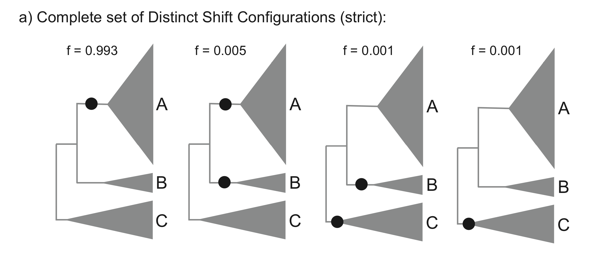
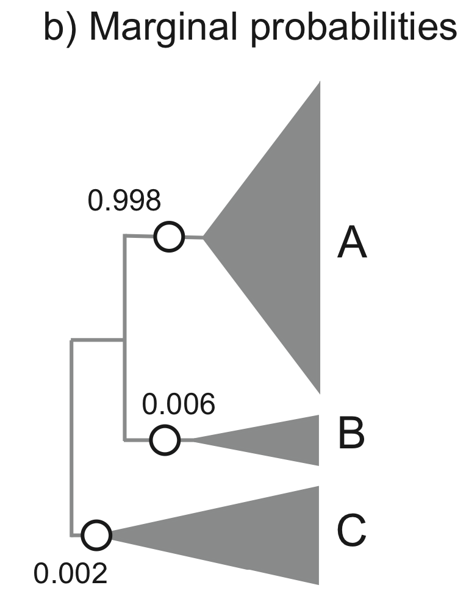
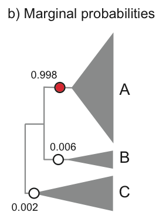
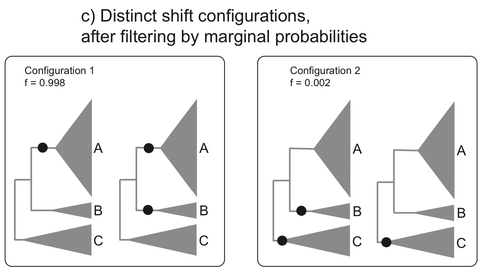

.. _rateshifts: 

Rate Shifts on Phylogenies: Theoretical Background
==================================================

This section details some of the most common conceptual issues that can arise when interpreting rate shifts on phylogenetic trees. Many studies have attempted to identify ***the*** rate shifts within a given dataset. In the BAMM framework, there is no single set of independent rate shifts waiting to be identified. Rather, BAMM identifies *configurations* of rate shifts - sets of shifts that are sampled together - and enables us to compute relative probability of those configurations. Three *shift configurations* sampled with BAMM during simulation of the posterior are shown :ref:`here<dtmulti>`.
 
Many features and analyses with BAMM and BAMMtools **will not be clear** unless you have a good understanding of the concepts below. It is especially important to grasp the idea of *distinct shift configurations* and *marginal shift probabilities*.
 
The BAMM model is an approximation
..................................

The models of diversification and trait evolution implemented in BAMM are approximations. This is true for any statistical model that you can use to extract information from data. Let's consider a few assumptions of the models implemented in BAMM. The model assumes that a relatively small number of discrete shift events can explain the data (sort of.... it is more that the marginal likelihood of any particular model is implicitly penalized by the addition of more parameters).It is possible that many shifts in evolutionary dynamics change in a discrete fashion (e.g., the classic "key innovation" scenario), but it is also possible that major changes in dynamics occur through a number of sequential changes in some general region of a tree (see figure below).

.. _shifts1: 
.. figure:: figs/x_interpret1.png
   :width: 700
   :align: center

This is the cetacean phylogeny (try ``data(whales)`` to load this tree) included as an example dataset with BAMMtools, and you can see some examples of rate variation across this tree :ref:`here<dtpolar>`. The tree on the left depicts the maximum shift credibility configuration identified by BAMM. This is simply the shift configuration sampled during simulation of the posterior with the highest marginal probability, analogous to the "maximum clade credibility tree" sampled during a Bayesian phylogenetic analysis (see below). The tree on the right gives an alternative interpretation of the results that would be invisible in the BAMM framework. Here, a relatively minor set of evolutionary shifts combine to produce - over several branches (red) - a major shift in evolutionary dynamics.

The point is that BAMM - and every other model that assumes discrete shifts in dynamics - can only detect discrete shifts in dynamics. Strictly speaking, this is less of a limitation for BAMM than other approaches. Because BAMM explicitly allows rates to vary through time after the point occurrence of a shift, the model does a reasonable job of tracking some types of continuous variation in evolutionary rates. In general, though, a spike in evolutionary rates inferred along a particular branch is fully consistent with the possibility that the "true" process involved a relatively continuous acceleration in rates that occurred over several branches. More generally, it is unlikely that such a continuous acceleration scenario over a relatively short period of time (e.g., tree on right) can even be detected from the sort of data we typically have available to us.

This is not a weakness *per se* of BAMM, and it applies to all other "macroevolutionary" scale modeling frameworks of which we are aware. However, recognizing the limitations of the discrete shift framework has a number of practical implications for interpreting patterns in data.  

Multiple distinct rate shift configurations can explain your data
.................................................................

With most phylogenetic datasets, it is unlikely that you will be able to identify the specific branches on which rate shifts have occurred with extremely high confidence. More typically, you will be unable to exclude several different shift configurations that potentially account for a given pattern of phylogenetic branching or phenotypic diversity. 

Currently, stepwise AIC and other model selection approaches are used to identify a single best set of rate shifts. We will single out some work that we have previously been involved with as an example of this type of approach. In Rabosky et al. (Proc. R. Soc. B, 274:2915-2923, 2007) and Alfaro et al. (PNAS 106:13410-13414, 2009), an information-theoretic model selection procedure is used to fit a set of models to phylogenetic data. Model complexity starts at 0, with the assumption that a single set of evolutionary rate parameters apply across an entire phylogeny. The algorithm then considers a more complex model, with two distinct evolutionary rate partitions across the tree. The actual likelihoods and AIC scores reported in these papers (and most subsequent papers that have cited them) tell us only about the relative fit of a model with *X* rate shifts relative to a model with *Y* rate shifts. There is typically no information in these analyses that provides the relative probability of different rate shift :ref:`configurations<dtmulti>`. All we get is the maximum likelihood *point estimate* of the best-fit shift configuration, but we get no information regarding our confidence in that estimate relative to other shift configurations with an identical number of rate shifts. 

Here's a graphical illustration of the logical problems associated with this. Suppose you analyze a particular phylogeny and find that a model with 2 distinct rate regimes fits the data better than a single rate regime with probability 1.0. You report the location of your rate shift identified using the stepwise procedure as follows:
 
.. figure:: figs/xFig2a.png
   :width: 600
   :align: center

You go on to discuss this as strong evidence for a rate increase along the branch leading to clade A. You propose several potential key innovations that may have occurred along the branch leading to clade A that can potentially account for this discrepancy in species richness between clades A and B. 

The problem here is that you have confounded statistical evidence for the **number of rate shifts** with statistical evidence for the **location of the rate shifts**. These are not the same. In fact, you have merely reported a single *point estimate* for a rate shift location that is consistent with your data. The true evidence for your rate shift locations might look more like this:

.. _toyshifts: 
.. figure:: figs/xFig2b.png
   :width: 600
   :align: center

Here, you can see that - despite overall strong evidence for the occurrence of a rate shift *somewhere* in your tree - you can't distinguish between several **very different** scenarios that have roughly equal probability. You can arrive at the observed disparity in diversity between clades A and B by (1) having a rate increase on the branch leading to clade A, or (2) a rate decrease on the branch leading to clade B. Unfortunately, there is nothing in your stepwise model-selection framework that provides this information. And these two scenarios lead to very different biological interpretations.

Simply speaking, reporting only the *maximum likelihood* shift location on a phylogenetic tree is exactly the same as publishing a single "best" estimate of a phylogeny with no measures of clade support. This would never be acceptable in the phylogenetic literature: at a minimum, we require bootstrap evidence, posterior probabilities, decay indices, or some other measure of the robustness of a particular inferred topology. However, in studying macroevolutionary dynamics, we frequently do *exactly what we would never do in phylogenetic biology*: we present point estimates with no probabilistic support measures, and we have mistaken support for a particular **number of shifts** for support bearing on their location.

Addressing this issue is one of the primary reasons that we created BAMM.

Is this really an issue with real datasets?
-------------------------------------------
 
**Yes**.

We have encountered very few datasets where signal of a shift in rate dynamics along a particular branch is so strong that we can exclude alternative shift configurations with probability > 0.95. 

Consider the analysis of whale diversification, which we've included as an example dataset in BAMMtools. We also use this dataset as an empirical example in the primary description of the BAMM model. The figure below shows reconstructed speciation rates through time during the whale radiation (red = fast, blue = slow) under BAMM. Overall, the model with the highest posterior probability had two rate dynamics, and a model with just a single rate dynamic had a posterior probability approach zero. The marginal (branch-specific) probabilities of a rate shift occurring on the 3 most likely branches are as follows:
 
.. _whalemarg1:  
.. figure:: figs/xfig3a.png
   :width: 650
   :align: center

Overall, we have very strong evidence for a shift in diversification dynamics somewhere near the origin of the dolphin clade, and the probability that at least one of the shifts illustrated above occurs is greater than 0.99. Although we are confident that a shift in dynamics **has** occurred, we cannot pin down a precise location of the shift. It would be incorrect to assert that the shift occurred on the branch with the highest marginal probability; it is almost as likely (p = 0.43) that the shift occurred on one of the ancestral branches immediately preceding the origin of the dolphin clade. 

Rate shifts are not independent
...............................

Marginal shift probabilities - the probability that a shift occurred on a given branch, ignoring everything else in the tree - are useful, but they are **not independent** of shifts occurring elsewhere on the tree. The marginal shift probabilities in the figure :ref:`above<whalemarg1>` cannot be treated as independent. In fact, the joint probability of a shift occurring on any two of the 3 principal branches (e.g., those with probs 0.05, 0.38, and 0.56) is approximately zero for all combinations. In other words, if you have a shift on one of these 3 branches for a given sample from the posterior, the conditional probability of a shift on any of the other branches leading to the dolphin clade is approximately zero. 

Put simply: there is very strong (prob > 0.99) evidence for a shift in dynamics somewhere along the ancestral 3 branches leading to the core dolphin clade. But there is only evidence for one such shift. Almost every sample from the posterior has a shift on at least one of these 3 branches, but no sample has a shift on more than one of these branches. 

Because of the non-independence of rate shift configurations, it doesn't really make sense to show - in a single tree - all the rate shifts discovered by BAMM. A good (but imperfect) analogy for thinking about rate shift configurations and their potential non-independence comes from Bayesian phylogenetic analysis. Any given shift configuration is like a phylogenetic tree sampled from a posterior. Some trees in that posterior will be incompatible with others. Trying to show all the rate shifts at once on a single tree, or reporting them as though they are independent, is sort of like trying to show a phylogenetic tree where you show all recovered clades at the same time. Suppose in a Bayesian phylogenetic analysis of 3 clades (A, B, C) you recover, each with probability 0.5, the following topologies: (A,(B,C)) and ((A,B),C). These topologies are incompatible, and it doesn't make sense to demand a single phylogenetic tree that represents all sampled clades within a single tree. The solution in phylogenetics is to collapse these incompatible topologies to a consensus tree with a polytomy. Showing all rate shifts recovered with BAMM on a single phylogenetic tree is a bit like showing a consensus phylogeny with polytomies: it isn't the "true" tree, but it summarizes some of the total run information.

Analysis of rate shifts in the BAMM framework
...........................................................

There are many types of information that can be extracted from a BAMM run. Here we describe several useful methods of summarizing and visualizing shift information from a BAMM analysis.

Shift configurations sampled with BAMM
--------------------------------------

One of the most important ideas to grasp regarding BAMM is that BAMM simulates a posterior distribution of *shift configurations* on phylogenetic trees. Hence, every sample from a posterior simulated with BAMM may contain a potentially unique configuration of rate shifts. Here are 3 different shift configurations for the primates dataset included in BAMMtools. The fourth tree is a phylorate plot, showing instantaneous (marginal) phenotypic evolutionary rates at fine-grained set of points along the phylogeny. Note that the shift configurations are different for each sample from the posterior. 

.. _primateconfigs:  
.. figure:: figs/xprimates_shiftconfigs.png
   :width: 650
   :align: center

Marginal shift probabilities
----------------------------

The marginal shift probabilities on individual branches across the tree are of considerable interest. As discussed above, there are some nuances to interpreting these, because the probability associated with a shift on any particular branch is not independent of other branches in the tree. The following snippet of R code will compute the marginal shift probabilities for each branch in one of the example datasets included with BAMMtools. It is not necessary to understand (or even run) this code yet; we will cover BAMMtools in much greater depth in subsequent sections. 

If you don't have BAMMtools installed and/or don't know how to install it, you may wish to read the first few paragraphs of :ref:`this section<bammtools>`. First, we load BAMMtools::

	> library(BAMMtools)

Now, we load two datasets included with BAMMtools: a time-calibrated phylogenetic tree of living whales (``whales``), and an output file from our BAMM analysis (``events.whales``). We will load these using the ``data`` function in R::

	> data(whales)
	> data(events.whales)
	
Now we convert the phylogeny and BAMM output file into a particular data object that is at the heart of BAMMtools analyses::
	
	> ed <- getEventData(whales, events.whales, burnin=0.1)
	
Object ``ed`` is now a ``bammdata`` object. Finally, we can compute the marginal shift probabilities for this phylogeny::	
	
	> marg_probs <- marginalShiftProbsTree(ed)

The object ``marg_probs`` is a copy of the original phylogenetic tree, but where the branch lengths have been replaced by the branch-specific marginal shift probabilities. In other words, the length of a given branch is equal to the percentage of samples from the posterior that contain a rate shift on that particular branch.

You can convey this information in several possible ways. You can directly indicate marginal shift probabilities on a phylorate plot, as shown :ref:`here<whalemarg1>`. You can plot your ``marg_probs`` tree itself: the branches are scaled directly by probabilities, so a tree plotted in such a fashion conveys quite a bit of information (see Figure 9 from `Rabosky 2014 <http://www.plosone.org/article/info%3Adoi%2F10.1371%2Fjournal.pone.0089543>`_ for an example of such a plot). You could create such a plot by simply executing::
	
		> plot.phylo(marg_probs)
		
in R. You can potentially color branches by their marginal shift probabilities, or you could add circles to each branch with a shift probability greater than some threshold.

But don't get hung up on the fact that your shift probabilities are less than 0.95. Even *very* strongly supported rate heterogeneity will generally be associated with marginal shift probabilities < 0.95. As discussed :ref:`here<whalemarg1>`, you can (and often will) have exceptionally strong evidence for rate heterogeneity even if any given branch has marginal shift probabilities that do not appear particularly high. **Marginal shift probabilities tell you very little about the probability of rate heterogeneity in your dataset**. In principle, you could have high confidence that your data were shaped by a very large number of rate shifts, but at the same time find that no single branch has a marginal probability exceeding 0.10. 

.. _bayesfactorbranches:

Bayes factors as evidence for rate shifts
---------------------------------------------

.. _coreshifts:

Identifying the distinct shift configurations
---------------------------------------------
For any given phylogenetic tree, there are many possible **topologically distinct shift configurations**. A topologically distinct shift configuration on a phylogeny is one that is distinguishable from all other shift configurations by the presence or absence of a rate shift on at least one branch. The total possible number of **distinct shift configurations**, or *D*, for a given tree with *N* branches is simply

.. math::
	D_N = \sum_{k = 0}^{N}\dbinom{N}{k}
 
This includes one shift configuration for the case where there are no rate shifts, one configuration for the case where every branch has a rate shift, and all combinations between those two extremes. This is a large number for real phylogenies. 

In reality, if we were to enumerate every single **distinct shift configuration**, we would end up with a very large set of shift configurations. However, the vast majority of these would contain rate shifts of no significance. During simulation of the posterior, BAMM is continuously proposing new shifts (and deleting shifts), and - if you simulate for long enough- you will end up with non-zero marginal shift probabilities for every branch in the tree. In other words, the mere fact that you have placed a non-zero prior on the number of shifts on the tree means that you will detect shifts on every branch if you run BAMM for long enough. For example, suppose you run BAMM on a dataset and observe the following shift configurations in your posterior distribution:

.. _distinctshifts_illustrate_A:  

   
The number *f* associated with each configuration gives the corresponding posterior probability. We refer to this set of shift configurations (part a) as **strict**, because it truly does show every single shift that was sampled in the posterior. Now, only one of these shift configurations is observed with any appreciable frequency: the first dominates the posterior, with probability 0.993. We can tabulate the marginal shift probabilities for each branch and show them on a single tree: 
   
.. _distinctshifts_illustrate_B:  

In reality, every BAMM analysis would generate enormous numbers of distinct shift configurations if we tracked every trivial occurrence of a rate shift in the posterior. In the BAMM model, we **expect shifts to occur on every branch with some low frequency simply as a function of the prior alone**. Hence, our solution is to divide rate shifts into **core shifts** and **non-core** shifts. **Core shifts** are those that are actively retained during simulation of the posterior: they contribute appreciably to your ability to model the data. **Non-core shifts** are simply ephemeral shifts that don't really contribute anything: they are simply what you expect under the prior distribution for rate shifts across the tree. In BAMMtools, we provide functions for explicitly estimating the expected frequency of observing shifts on every branch of the tree under the prior alone. Any branches with shift probabilities that can be explained by the prior are ignored during the enumeration of distinct shift configurations. 

Consider the example above. Let's imagine that we have done an analysis of our prior distribution (this is done by default in BAMM), and that we have estimated the expected probability of shifts on each of the branches in the tree. Suppose the 95th percentile on the expected number of shifts per branch is 0.01. In this case, the frequencies of shifts on the branches leading to B and C are just what we expect under the prior. They are thus designated as **non-core** shifts:

.. _distinctshifts_illustrate_D:  

Here we've denoted the **non-core** shifts in white, and the single **core** shift in red. The **core** shift is the only one that occurs more often in the posterior than we expect under the prior alone. This exercise leads us to exactly two distinct shift configurations for this dataset: those with a shift on the branch leading to A, and those lacking this shift. We can assign the four shift configurations from the strict set (a, above) to each of these new distinct shift configurations, and we can compute their posterior probability:

.. _distinctshifts_illustrate_C:  

Credible set of shift configurations
------------------------------------
Given a set of distinct shift configurations and their posterior probabilities, we can immediately extract the 95% (or other) credible set of shift configurations. To do this, we rank each shift configuration by their posterior probability. Starting with the most probable shift configuration, we then continue adding shift configurations to the set until the set accounts for at least 95% of the total probability. 

To do this with BAMMtools, we will first compute the threshold between **core** and **non-core** shifts by analyzing the prior distribution on the number of shifts. Here, we will use another dataset from BAMMtools consisting of body size data for living primates::

	> library(BAMMtools) # load BAMMtools
	> data(primates) # load primate phylogeny
	> data(prior.primates) # Prior distribution simulated with BAMM
	> prior.threshold <- getBranchShiftPriors(primates, prior.primates)
	
``prior.threshold`` is now a copy of our phylogenetic tree, but where each branch is the marginal probability threshold for distinguishing between **core** and **non-core** shifts. To compute the credible set, we do::

	> data(events.primates)
	> edata <- getEventData(primates, events.primates, burnin=0.1, type ='trait')
	> css <- credibleShiftSet(edata, threshold = prior.threshold)
	
And we can view and plot the results with two other BAMMtools functions: ``summary.credibleshiftset`` and ``plot.credibleshiftset``.

Overall *best* shift configuration
----------------------------------

Marginal shift probabilities don't tell you much about the most likely sets of shifts that generated your dataset, and it is generally not possible to show all shift configurations sampled during simulation of the posterior. One possibility is to show the maximum *a posteriori* probability (MAP) shift configuration. This is the distinct shift configuration with the highest posterior probability - e.g., the one that was sampled most often. In BAMMtools, it is straightforward to estimate (and plot) this. Here, we will do this using the example primates dataset::

	> data(primates, events.primates, prior.primates)
	> priors <- getBranchShiftPriors(primates, prior.primates)
	> ed <- getEventData(primates, events.primates, burnin=0.1, type = 'trait')
	> best <- getBestShiftConfiguration(ed, threshold=priors)
	> plot.bammdata(best)
	> addBAMMshifts(best, cex=2)

In general, if you show a shift configuration estimated with BAMM for publication, we recommend showing the MAP configuration as estimated by ``getBestShiftConfiguration``.

Maximum shift credibility configuration
---------------------------------------

An alternative estimate of the *most likely shift configuration* is the **maximum shift credibility configuration (MSC)**. This concept is analogous to the *maximum clade credibility* tree in a Bayesian phylogenetic analysis. The MSC configuration is a rate shift configuration that was actually sampled by BAMM and which is one estimate of the best overall configuration. Formally, the MSC configuration is estimated in several steps. First, we compute the marginal shift probabilities on each branch of the tree. For the i\ :sup:`th` branch, denote this probability as p\ :sub:`i`. For each sample shift configuration from the posterior, we then compute the product of the observed set of shifts, using these marginal probabilities. These are then weighted by the posterior probability of sample *k* (as defined by the number of processes), or *P(k)*. The shift credibility score *C* for the k\ :sup:`th` sample is computed as: 

.. math::
		C = P(k) \prod_{i = 1}^{N}{p_i^{I_{i,k}}}{(1 - p_i)^{1 - I_{i,k}}}

where I\ :sub:`i,k` is an indicator variable taking a value of 1 if a shift occurs on branch *i* for sample *k*, and 0 if no shift occurs in the sample. In BAMMtools, you can easily estimate the MSC configuration::

	> library(BAMMtools)
	> data(primates, events.primates)
	> ed <- getEventData(primates, events.primates, burnin=0.1)
	> msc_tree <- maximumShiftCredibility(ed)

Here we'll simply plot the MSC shift configuration on a boring (non-phylorate) version of the primate tree:

.. _primatemsc:  
.. figure:: figs/xprimates_msc.png
   :width: 600
   :align: center

The MSC tree has a total of two shifts (red circles). We generally recommend using the MAP shift configuration (``getBestShiftConfiguration``) over the MSC configuration, except for very large phylogenies. Often, however, the two approaches will estimate the same shift configuration.

Cumulative shift probabilities
------------------------------

The *cumulative shift shift probability tree* shows the probability that a given node has evolutionary rate dynamics that are decoupled from the root process. For a given node to be decoupled from the "background" evolutionary dynamic, a rate shift must occur somewhere on the path between the node and the root of the tree. Branches with a cumulative shift probability of 1.0 imply that every sample in the posterior shows at least one rate shift between the focal branch and the root of the tree, leading to evolutionary dynamics that are decoupled from the background process. 

Consider the whale diversification :ref:`analysis<whalemarg1>`. Even though we have relatively low confidence of the precise branch on which a shift may have occurred, we have high confidence that a shift occurred on one of the ancestral branches leading to the dolphin clade. Formally, the cumulative shift probability for branch b\ :sub:`i` is computed as:
 
.. math::

	b_i = \frac{\sum_{k = 1}^{S}\Phi_{k,i}}{N}	

where :math:`\Phi_{k,i}` is an indicator variable that takes a value of 1 if a shift occurs somewhere on the path between branch *i* and the root of the tree (0 otherwise). The cumulative shift probability on a particular branch :math:`b_i` might thus be extremely high even if shifts are unlikely to have occurred on branch :math:`b_i` itself. Here we will compute the marginal shift probability tree using the *cumulativeShiftProbsTree* function from BAMMtools. 
 
Here is another view of the whales analysis where we will use color to show all branches that are "strongly" associated (p > 0.95) with diversification dynamics that are decoupled from those at the root of the tree.
  
.. figure:: figs/x_whales_cst.png
   :width: 600
   :align: center
 
 
How *not* to interpret marginal shift probabilities
--------------------------------------------------------

It is incorrect to assume that you need "significant" (p > 0.95) marginal shift probabilities or cumulative shift probabilities to demonstrate significant rate heterogeneity in your dataset. The evidence for rate heterogeneity comes from considering the posterior probabilities on the number of shifts, or - even better - the Bayes factor evidence in favor of model with *k* shifts (:math:`M_k`) relative to a model with 0 shifts (:math:`M_0`).

In the toy example :ref:`above<toyshifts>`, we had evidence for rate heterogeneity in the dataset (with posterior probability 1.0), yet neither the marginal shift probabilities (0.49, 0.51) nor the cumulative shift probabilities (same as marginals for this example) would be "significant".  This is a most important point: you can have massive evidence for rate heterogeneity in your dataset, but both your marginal and cumulative shift probabilities will be a function of the frequency distribution of **distinct alternative shift configurations**.

The primate body mass example dataset is a good example of this. Here, we have strong evidence against a single evolutionary rate regime. In fact, the Bayes factor evidence favoring a model with 5 rate regimes (:math:`M_5`) versus a model with 0 rate regimes (:math:`M_0`) exceeds 60,000. For :math:`M_5` versus :math:`M_1`, this ratio exceeds 8,000. Numbers like these imply that it isn't even worth considering simple models of body size evolution (e.g., one or two-rate Brownian motion models). 

