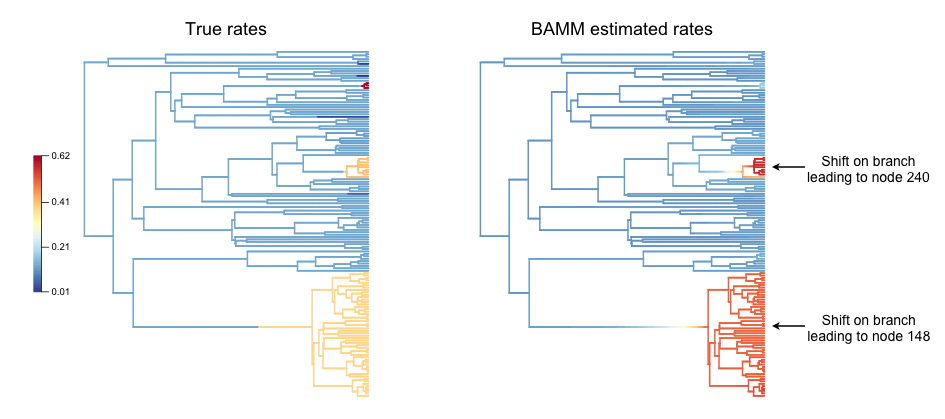
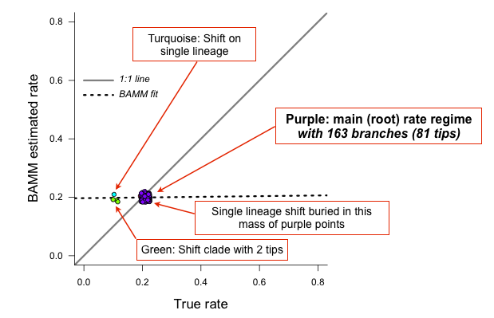
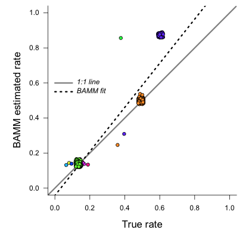

Is BAMM reliable? A DIY approach
==================================

Overview
------------------------------------------
We have demonstrated that major claims from the Moore et al (2016; hereafter, MEA) assessment of BAMM are incorrect or unjustified; see the full :download:`Systematic Biology<filesForDownload/Rabosky_etal_SystematicBiology_2017.pdf>` article and associated :download:`Supplementary Information<filesForDownload/SupplementaryMaterial_BAMM_Text&Figures.pdf>`. Specifically: 

* The MEA likelihood function is theoretically invalid and did not demonstrate pathologies with the BAMM likelihood that are attributable to unobserved rate shifts.

* The problem of "unobserved rate shifts" is a non-issue in biologically plausible regions of parameter space

* There is no evidence that prior sensitivity is problematic for BAMM. The purported prior sensitivity documented by MEA has never been a problem for the default :math:`\gamma = 1` , or ``expectedNumberOfShifts = 1`` priors. MEA merely re-documented precisely the same prior sensitivity that was presented by Rabosky (2014) for earlier versions of the software. MEA's non-standard usage of the software partially replicated behaviors from earlier versions of the program. **Figure 3 from Rabosky (2014) clearly illustrates this point and predates MEA's key result by several years.**

* MEA's simulated "variable rate" phylogenies are compromised by ascertainment bias and are effectively identical to constant-rate trees. The summary statistics chosen by MEA are unable to distinguish between low statistical power and poor performance. MEA erroneously interpreted *lack of evidence for rate variation* as indicative of *unreliable rate estimates*. 

* We demonstrate that current and past versions of BAMM have provided reliable inferences on evolutionary rates.

These and other topics are treated at length in the Systematic Biology article. Here we describe how users can independently assess rate reliability with BAMM, using phylogenetic tree simulation code developed by MEA.
  
Assessing rate reliability on your own
------------------------------------------

**We encourage users not to take our assessment of BAMM's performance at face value, but to verify the performance of the method on their own.** We will:

* Simulate phylogenies with rate shifts under a Poisson process model of rate variation exactly as in MEA, using their tree simulation code and input parameters

* Analyze the resulting phylogenies with BAMM

* Compute summary statistics that determine how well BAMM performed

The relevant R files for reproducing these analyses are here:

* General :download:`library<testingbamm/R_test_BAMM_functions.R>` of functions we've assembled to facilitate tree simulation and analysis

* :download:`Script<testingbamm/R_simulate_tree_from_seed.R>` that illustrates how you can simulate *rate shift* trees using MEA's phylogenetic tree simulator

* :download:`Script<testingbamm/R_BatchSimulate_MEA_trees.R>` that illustrates how to perform batch simulation of trees using MEA's tree simulator

* :download:`Script<testingbamm/R_analyze_BAMM_results.R>` that reproduces all BAMM performance assessments below, including all figures and results exactly as they are shown

Simulating trees with rate shifts under a Poisson process
-----------------------------------------------------------

The :download:`Systematic Biology<filesForDownload/Rabosky_etal_SystematicBiology_2017.pdf>` article (see *Claim 5*) provides a detailed explanation for why MEA's analyses were compromised by low statistical power and ascertainment bias. We encourage readers to consult that section of our article for additional information. 

We will simulate a set of phylogenies using the tree simulator and input parameters used by MEA to generate their purportedly *variable rates* dataset, which they used to argue that BAMM-estimated rates are unreliable. We will perform 20 simulations, seeding the random number generator in each simulation with the corresponding integer (1, 2, 3.... 20), such that you are able to generate trees that are identical to those generated here (setting the *seed* ensures that the random number generator underlying the simulation draws the exact same sequence of random numbers).

MEA rejected all trees that had (i) fewer than 50 tips, (ii) more than 150 tips, and (iii) no rate shifts. However, most phylogenies generated under their parameters do not fall into this acceptance region (50 - 150 tips). They rejected the majority of simulated outcomes under their parameters, such that they selected for trees where power to infer rate variation was low (again, see "Claim 5" and Figure 7 from the Systematic Biology article linked above). 

Attached :download:`here<testingbamm/R_BatchSimulate_MEA_trees.R>` is a script that loops over random starting seeds from 1 to 20 and generates corresponding phylogenies using MEA's code. **Only 2 trees out of 20 would have satisfied MEA's acceptance criteria: the tree with seed = 8 (with 144 tips) and the tree with seed = 9 (with 85 tips).** Seeds 4, 16, and 20 generate trees that are too small. Most of the remaining seeds generated trees that are larger than 150 tips, including seed = 15 (302 tips; analyzed below).

Below, we will analyze trees generated with the following three seeds: 8, 9, and 15. The tools provided below can be used to craft your own performance assessment of BAMM.

Worked example: tree simulation with specified seed
------------------------------------------------------
 
First, we will load the necessary libraries and an R file we have developed that contains all necessary functions for these analyses::

	library(geiger)
	library(phytools)
	library(BAMMtools)
	library(diversitree)
	source("R_test_BAMM_functions.R")

Now we set up input parameterizations exactly as in MEA: we want exponential distributions with mean :math:`\psi` for speciation (:math:`\lambda`) and extinction (:math:`\mu`), such that :math:`\psi_\lambda = 0.15` and :math:`\psi_\mu = 0.05`. We will also set the rate-shift rate (transition rate) :math:`\eta = 0.006`, as in MEA. The conventions used below are arguments that we will pass to MEA's tree simulation function::

	lamfx <- function() return(rexp(1, 1/0.15))
	mufx <- function() return(rexp(1, 1/0.05))
	trate <- 0.006

The following block of code will set the seed for the random number generator, then simulate a tree using MEA's function `SimulateCBDPTree`, and prune the extinct lineages. We will also use one of our functions, `mea_to_edata` to extract all rate-shift data from the simulation and convert it into a BAMM-readable format (*event data*). We'll then write this *true* event data to file for subsequent processing.::

 	seed        <- 8
	seed_stub   <- paste("s", seed, sep="")
	treename    <- paste("tree_", seed_stub, ".tre", sep="")
	set.seed(seed) # this is important!
	tree        <- SimulateCBDPTree(35.5, trate, lamfx, 
				    mufx, verbose=F, NMAX = 5e3, MAX_FAILS = 1)
	simTree     <- CPBDPStochasticMap(tree)
	prunedTree  <- pruneCPBDPTree(simTree)
	edata       <- mea_to_edata(prunedTree)
 	write.table(edata[,1:8], file = paste(seed_stub, "_true_eventdata.txt", sep=""),
 				 sep=",", quote=F, row.names=F)

We have set this code above up to be sufficiently general that you can simply change the value of ``seed`` to repeat this analysis with any other random starting seed, and the code will automatically rename the output files accordingly. Every simulation you perform with ``seed = 8`` will be exactly the same!  

Now, we will set up a **control file** for a BAMM analysis. We've attached a script that makes this easy, but here's how to do this using `BAMMtools`. Here we will set up a time-constant run with BAMM, running for 5 million generations. We'll use the name of the tree file (with seed = 8) that was previously generated.::

	priors <- setBAMMpriors(prunedTree, outfile = NULL)
	write.tree(prunedTree, treename) 
	
	# Here is a block of parameters for the control file
	params = list(treefile = treename,
               numberOfGenerations = '5000000',
               overwrite = '1',
               expectedNumberOfShifts = '100',
               lambdaInitPrior = as.numeric(priors['lambdaInitPrior']),
               lambdaShiftPrior = '0',
               muInitPrior = as.numeric(priors['muInitPrior']),
               lambdaIsTimeVariablePrior = '0',
               updateRateLambdaShift = '0',
               updateRateEventPosition = '0.5',
               numberOfChains = '1', 
               outName = seed_stub)
 
	bammcontrolfile <- paste("control_", seed_stub, ".txt", sep="")
	
	# Now writing control parameters to file
	generateControlFile(file = bammcontrolfile, type = "diversification",
                params = params)

You are now ready to run BAMM on this tree. On OSX, simply move your control file that you generated above (here, the name is ``control_s8.txt``) to the directory that contains the BAMM executable, and run the program with:: 

	./bamm -c control_s8.txt
	

Worked example #1: tree with seed = 8
---------------------------------------
Running BAMM on the ``seed = 8`` tree should only take a few minutes. We will now assume that you have an event data file for the run, ``s8_event_data.txt``, along with the true shift data from the original simulation (``s8_true_eventdata.txt``).::

	# Read in tree, mcmc data, and BAMM output
	tree8    <- read.tree("tree_s8.tre")
	mcmc8    <- read.csv( "s8_mcmc_out.txt" , stringsAsFactors=F)
	ed8      <- getEventData(tree8,  "s8_event_data.txt", burnin=0.1, nsamples=200)
	true_ed8 <- getEventData(tree8, "s8_true_eventdata.txt")

Now we count the number of tips in each shift regime::

	ss8 <- shiftRegimeData(true_ed8)

This dataframe ``ss8`` includes all the shift data from the simulated tree, including true rate parameters, the time and location of the shift, and the number of tips and branches associated with each shift regime. If we inspect this dataframe (try ``head(ss8)``), we can see here that there are:

* 69 tips in the root regime 
* 52 tips in the 2nd largest regime
* 9 tips in the 3rd largest regime (this is row 5 of the dataframe).

Although there are still a number of tiny rate regimes (e.g., 6 shifts leading to 5 or fewer taxa), at least 3 rate regimes are large enough that we might *a priori* expect some statistical power to infer them. We will start by making a pair of visual plots to compare the **true** speciation rates across the tree to the **BAMM-inferred** speciation rates. On the left, we'll plot the tree with branches colored by true rate. On the right, we will plot the BAMM-inferred rates using the same color scale for rates in both trees.::

	plot.new()
	par(mfrow=c(1, 2))
	BAMMplot <- plot.bammdata(true_ed8, spex="s", breaksmethod="linear", lwd=2, tau=0.003)
	mtext("True rates", side=3, cex=1.5)
	addBAMMlegend(BAMMplot, location="left")
	plot.bammdata(ed8, colorbreaks=BAMMplot$colorbreaks, spex="s", lwd=2, tau=0.003)
	mtext("BAMM estimated rates", side=3, cex=1.5)
 
And here is the pair of phylorate plots (again, note that the rate-color map is identical for the two trees): 
 

.. _phylorate8: 

So, across this tree, BAMM appears to have more or less correctly inferred the locations with high rates, and it more-or-less gets the background (root regime) rates correct. We have labelled the clades where BAMM inferred high rates by their node reference numbers (in the `ape` package phylo format). These *shift* clades are nodes 148 and 240; you can inspect their true parameters in the dataframe ``ss8``. You can also see that there are several small rate regimes in the true (left) rate plot that are not inferred in the BAMM-estimated (right) plot. More on this below.

It also appears that the rates are somewhat overestimated, an issue we will explore in detail in the next few figures. We will now compute the BAMM-inferred speciation rates on each branch of the tree and compare them to the true rates. We'll do this using the function ``getMeanBranchLengthTree``, which expresses the rate-shift information as a phylogenetic tree where the branch lengths are equal to the speciation rate on each branch.::

	rates8   <- getMeanBranchLengthTree(ed8)$phy
	
	# Here is the corresponding tree where branch lengths equal TRUE rates
	rates8true <- getMeanBranchLengthTree(true_ed8)$phy

``rates8`` is a copy of our ``seed = 8`` tree where branch lengths are equal to the BAMM-estimated speciation rates (means of the marginal posterior distribution), and ``rates8true`` is a copy of the same tree where branch lengths are equal to the true rates. We will now fit a linear model to these rates to see how well BAMM did::

	fit <- lm(rates8$edge.length ~ rates8true$edge.length)
	summary(fit)

In this example, the estimated slope is 1.30. How does this look if we plot the branch rates and the fitted regression line? We will use three plotting functions from the ``R_test_BAMM_functions.R`` library to help. One sets up a pretty plotting frame; another assigns colors to each point based on their rate regime; another jitters the points slightly to reduce overplotting. Branches belonging to the same rate regime will have identical speciation rates, except on the actual branch where a rate shift occurs (in this latter case, the branch rate will be a weighted average of several rates)::

	plotSetup()
	# add fitted line:
	abline(fit$coefficients[1], fit$coefficients[2], lwd=3, lty="dotted")
 
	# plotting points, using jitter function: 
	points(j(rates8true$edge.length), j(rates8$edge.length), pch=21, bg="coral") 
	
	colset <- colorByRegime(true_ed8) #get colors for each branch
	
	# plotting points, using jitter function : 
	points(j(rates8true$edge.length), j(rates8$edge.length), pch=21, bg=colset) 

And we can see that BAMM does reasonably well at inferring the true rates:

.. _phylorate8b: 
.. figure:: testingbamm/s8_points.png
   :width: 400
   :align: center
   
There is one regime with :math:`\lambda \approxeq 0.65` that BAMM misses, but this regime only has 2 tips (and 3 branches). We can see that the BAMM fitted line passes through two rate regimes with true speciation rates between 0.4 and 0.45. In the figure above, these are colored pink, with 9 tips; and green-yellow, with 52 tips; these are regimes labelled above as nodes 240 and 148, respectively. If you look closely, you will see two orphan points belonging to these fast (node 148, node 240) clades: points that appear much closer to the background rate. These points are the branches on which the rate shifts occurred, so their rates are an average of the ancestral (root regime) rate and the new rate. 

It's clear from the figure that BAMM overestimates the rates for the two fast clades, but by how much? These two clades correspond to nodes 148 and 240 from the tree (see the ``ss`` dataframe created above, which contains this information). Here we will compute the average branch rate for these two clades::

	# Average branch rates for nodes 148 and 240:
	mean(extract.clade(as.phylo(rates8), node = 148)$edge.length)
	# gives 0.52 versus 0.39 true

	mean(extract.clade(as.phylo(rates8), node = 240)$edge.length)
	# gives 0.56 versus 0.41 true

It is worth asking how different these rates are from what we would get if we just fit a constant-rate birth-death model to each subclade separately. We have included a simple wrapper function to do this using code from `Diversitree`; this is the function ``birthdeath_fit`` which we've included here::
 
	birthdeath_fit(tree8, node = 148) 
	# estimate = 0.43 vs 0.39 true vs 0.52 BAMM
 
	birthdeath_fit(tree8, node = 240) 	
	# estimate = 0.62 vs 0.41 true vs 0.56 BAMM
	
In this case, BAMM is overestimating speciation rates for one clade (node 148) relative to `Diversitree`, but estimating them more accurately than `Diversitree` for the other clade (node 240). Keep in mind that this is not really a fair comparison, because we have told `Diversitree` exactly where on the tree to estimate the rates. BAMM had to find the shift location with no *a priori* information about where the shift might be.  

**Finally: should we be surprised that BAMM fails to detect the small rate regimes in the example here (e.g., the small light blue and purple rate regimes in the figure above)?** We address this question at length in the :download:`Systematic Biology<filesForDownload/Rabosky_etal_SystematicBiology_2017.pdf>` article. We use information theoretic evidence to show that, in general, such small rate regimes cannot be inferred by any diversification methodology. The likelihood of very small shift regimes is often very similar across a broad range of parameterizations, such that the likelihood of the data under the true parameters is about the same as the corresponding likelihood under somewhat different parameters. Our formal analysis (see *Claim 5* and associated figures from the Systematic Biology article) demonstrates that most of the phylogenies (>80%) in MEA's *variable rates* dataset lack sufficient information with which BAMM, and any other method, can infer rate variation.

Worked example #2: tree with seed = 9
---------------------------------------
We now turn to the tree generated with ``seed = 9``, which has 85 tips. This tree would have been included in MEA's *variable rates* dataset as it contains the right number of tips and at least one shift. We won't go through the exercise of tree simulation again, but you can use the script given above to repeat these analyses exactly. Simply plug in the new seed index to generate all the relevant files. We will start assuming that you've already run BAMM on this phylogeny::

	tree9    <- read.tree("tree_s9.tre")
	ed9      <- getEventData(tree9,  "s9_event_data.txt", burnin=0.1, nsamples=200)
	true_ed9 <- getEventData(tree9, "s9_true_eventdata.txt")

Now we will explore the shift regime data::

	ss9 <- shiftRegimeData(true_ed9)
	head(ss9)
	
There are only 4 rate regimes for this tree (only 3 rate shifts). These shifts are tiny: one has 2 tips, and two others have 1 tip each. This tree is characteristic of the trees in MEA's variable rates dataset, where the largest non-root shift regime in most trees contained 5 or fewer taxa (for details, see Figure 7 from our Systematic Biology article that responds to MEA). We might suspect, *a priori*, that BAMM will not find these tiny rate regimes that include 2 or fewer tips. How many shifts did BAMM find on this tree?::

	summary(ed9)
	
Thus, there is very little evidence for rate variation in this dataset: 85% of samples from the posterior had zero shifts, which is consistent with our expectations - we don't expect BAMM to have much power to infer small rate regimes. Here is the side-by-side comparison of the phylorate plots for true and BAMM-inferred rates::

	plot.new()
	par(mfrow=c(1, 2))
	BAMMplot <- plot.bammdata(true_ed9, spex="s", breaksmethod="linear", lwd=2, tau=0.003)
	addBAMMshifts(true_ed9, par.reset=F, cex=2, bg = "black")
	mtext("True rates", side=3, cex=1.5)
	addBAMMlegend(BAMMplot, location="left")
	plot.bammdata(ed9, colorbreaks=BAMMplot$colorbreaks, spex="s", lwd=2, tau=0.003)
	mtext("BAMM estimated rates", side=3, cex=1.5)

Simple visual inspection of these trees suggests that BAMM did a good job of recovering the dominant rates across the tree: 

.. _phylorate9: 
.. figure:: testingbamm/phylorate9.png
   :width: 700
   :align: center

For the true tree (left), we have added black circles to the (true) shift locations, which makes it clear that the rate shifts lead to tiny shift regimes. If you squint, you can see several branches (in the *true* plot) corresponding to the shift locations. BAMM does not find these. Let's compare the overall mean speciation rate for each tree relative to the BAMM estimate; we'll do this using the function ``getCladeRates`` from `BAMMtools`::

	mean(getCladeRates(ed9)$lambda)
	# approximately 0.20

	# the "true" mean using the actual shift data:
	mean(getCladeRates(true_ed9)$lambda)
	# approximately 0.21

This mean (:math:`\lambda = 0.21`) corresponds very well to the rate for the root regime, which you can access as: ``ss9[1, ]``. So: on the whole, BAMM did very well at getting the whole-tree mean rate, despite failing to find several tiny rate regimes. 

Regression analysis of low-power trees is misleading
......................................................

MEA concluded that BAMM-estimated rates are unreliable by performing branch-specific regressions of rates, as above, for trees in their *variable rates* dataset. They write: *"... the true and estimated branch-specific diversification-rate parameters are uncorrelated when rates of speciation and extinction vary across the tree (Fig. 6, Middle, gray lines)."* However, when simple regression analyses are performed on phylogenies that lack evidence for rate variation, the average slope for branch-specific rates is expected to be zero. Let's repeat the branch-specific regression analysis performed above on this low power (``seed = 9``) tree::

	rates9   <- getMeanBranchLengthTree(ed9)$phy

	# Here is the corresponding tree where branch lengths equal TRUE rates
	rates9true <- getMeanBranchLengthTree(true_ed9)$phy

	# Fit a linear model to the estimated vs true branch rates
	fit9 <- lm(rates9$edge.length ~ rates9true$edge.length)
	summary(fit9)
	
We now obtain a slope of 0.01, and an r2 value of 0.0. The corresponding Spearman correlation between true and estimated rates is just 0.02. However, if we actually plot the BAMM-estimated and true rates, we can see the slope itself is an extremely misleading summary statistic of BAMM's performance::

	plotSetup()

	# add fitted line:
	abline(fit9$coefficients[1], fit9$coefficients[2], lwd=3, lty="dotted")
 
	colset <- colorByRegime(true_ed9)
	# plotting points, using jitter function from above: 
	points(j(rates9true$edge.length), j(rates9$edge.length), pch=21, bg=colset) 
 
Here is the resulting plot:

.. _phylorate9b: 
.. figure:: testingbamm/s9_points.png
   :width: 400
   :align: center

Yes, the BAMM slope is zero, but this is attributable solely to the fact that BAMM did not infer any of the three tiny rate regimes (with just 1, 1, or 2 tips). Some annotation may make this clearer:

.. _phylorate9c: 

So: across the entire tree, a total of 163 branches belong to the root regime, with a true rate of :math:`\lambda = 0.21`. There are only 5 branches that do not belong to this rate class: two singleton lineages, and another with just 3 branches. BAMM did very well at inferring the overall rate across the tree, but cannot detect rate variation when shift regimes are tiny and/or of small effect. In this example, for the regression slope to suggest *good* performance, BAMM would have to be capable of accurately inferring rates for regimes with just 1 (turquoise) or 2 (green) tips. Moreover, the regression analysis above implies poor performance even when BAMM has estimated, with perfect accuracy, the rates across more than 98% of the branches in the tree!

MEA's claim that BAMM rates are unreliable is due to their analysis of phylogenies that are statistically indistinguishable from a constant-rate birth-death process, thus yielding results similar to those we've illustrated here for ``seed = 9``. We found that more than 80% of MEA's phylogenies contained no information that BAMM (and other programs) could use to infer rate variation (see *Claim 5* and Figures 8 - 12 from the Systematic Biology article). Their purported *variable rates* dataset is largely *information free*, at least from the perspective of among-lineage rate variation. Hence, for the vast majority of MEA's trees, we expect branch-specific slopes to provide an inaccurate summary of BAMM's performance, and it is unsurprising that MEA found mean slopes of zero when performing branch-specific regression analyses on these data. 
 
Worked example #3: tree with seed = 15
----------------------------------------

We will go through just one more tree - ``seed = 15`` - the only other tree generated with MEA's parameters that contained between 50 and 500 tips for this set of starting seeds. MEA would have rejected this tree, as it exceeded their size selection criterion, but this tree is characteristic of the large number of trees that have sufficient information with which to infer rate variation yet which were excluded from their analyses. As for the ``seed = 9`` analyses above, we will not repeat the tree simulation exercise: simply plug in ``seed = 15`` to the relevant line of the script file accompanying this page, and you can generate all necessary input files. We now assume that you have run BAMM on this dataset.::
	
	tree15    <- read.tree("tree_s15.tre")
	ed15      <- getEventData(tree15,  "s15_event_data.txt", burnin=0.1, nsamples=200)
	true_ed15 <- getEventData(tree15, "s15_true_eventdata.txt")

	# Now we count the number of tips in each shift regime
	ss15 <- shiftRegimeData(true_ed15)
	head(ss15)

This is a tree where we'd expect BAMM to have high power. There are 3 rate regimes with decent numbers of tips, corresponding to rows 1, 2, and 4 from the ``ss15`` data frame. Row 3 (node 307) is a shift regime with 6 tips, but we expect BAMM to not infer this regime: note how similar the speciation rate is to the root regime rate (:math:`\lambda = 0.13` versus :math:`\lambda = 0.14`). If we look at the raw posterior on the number of shifts, we see that BAMM recovered substantial evidence for rate variation::

	summary(ed15)
	
Less than 1% of the posterior distribution included shift configurations with 1 or fewer shifts (e.g., 99% had 2 or more shifts), and the posterior mode is 3 shifts. We'll now generate a pair of phylorate plots::

 	plot.new()
	par(mfrow=c(1, 2))
	BAMMplot <- plot.bammdata(true_ed15, spex="s", breaksmethod="linear", 
				lwd=2, tau=0.003)
	mtext("True rates", side=3, cex=1.5)
	addBAMMlegend(BAMMplot, location="left")
	plot.bammdata(ed15, colorbreaks=BAMMplot$colorbreaks, spex="s", 
			lwd=2, tau=0.003)
	mtext("BAMM estimated rates", side=3, cex=1.5)

Here they are, true rates versus estimated rates:

.. _phylorate15: 
.. figure:: testingbamm/phylorate15.png
   :width: 700
   :align: center	

And finally, we will estimate branch-specific rates and consider whether they are correlated with true branch-specific rates. 
Following our examples above.::

	rates15   <- getMeanBranchLengthTree(ed15)$phy

	# Here is the corresponding tree where branch lengths equal TRUE rates
	rates15true <- getMeanBranchLengthTree(true_ed15)$phy

	# Fit a linear model to the estimated vs true branch rates
	fit <- lm(rates15$edge.length ~ rates15true$edge.length)

	summary(fit)

We recover a slope of 1.26 for BAMM-estimated versus true rates. We can plot these points, as we've done previously:

.. _phylorate15b: 

This looks pretty reasonable. BAMM estimates the rates for the root regime and the *orange* regime (:math:`\lambda = 0.50`) with near perfect accuracy. However, the large dark blue regime (true :math:`\lambda = 0.60`) is overestimated, with the BAMM rates approximately equal to 0.83. Let's check how well we'd do if we estimated diversification rates directly for this clade under the true model (node 345; row 4 in ``ss15``)::

	birthdeath_fit(tree15, node = 345)
	# lambda = 0.812, mu = 0.082

So, for this specific fast-speciating clade (node 345), BAMM's results are approximately equal to those obtained with a constant-rate birth-death process, which is the *true* model for this clade (because this clade has diversified under just a single rate regime). This suggests that BAMM's overestimate is somewhat expected. Estimates under the exact generating model for this clade, for which we have specified the precise shift location, are only marginally more accurate than those obtained with BAMM. 

General guidelines
----------------------------------------
We hope that the code and illustrative examples given above are useful if you consider performing your own assessment of BAMM's performance. As a general set of guidelines:

* Branch-specific analyses of rates (correlations or regression slopes) are reasonable only when the underlying data are sufficiently informative such that BAMM can infer rate variation. **Naive application of these statistics to trees that are identical to constant-rate trees will (incorrectly) suggest poor performance**.

* If BAMM fails to infer rate variation, whole-tree estimates of rates are usually more appropriate. Nonetheless, we believe BAMM *should* infer rate variation when it is theoretically possible to do so. In the examples above (seeds 8 and 15), we would have found it concerning if BAMM had failed to detect large shift regimes, or if BAMM had failed to estimate rates correctly across the largest shift regimes. In Rabosky et al. (2017, Systematic Biology), we illustrate how researchers can compute the theoretical information content associated with a given shift configuration (e.g., MEA's variable rates phylogenies). This approach should enable researchers to identify shifts that BAMM should, in principle, be able to detect.

* In Rabosky et al (2017, Systematic Biology), we also use regime-specific summaries to assess BAMM's performance. This approach treats each regime as a single data point and is well-suited for summarizing results across large numbers of trees that have been analyzed with BAMM. However, this approach also can confound low power with poor performance. Specifically, we expect BAMM to infer rates more accurately for regimes with many tips; for regimes with small tip counts, the BAMM rate will presumably be similar to the overall background rate across the phylogeny. In the Systematic Biology article, we analyze the correlation between true- and estimated regime rates explicitly with respect to the number of tips in each regime. 

